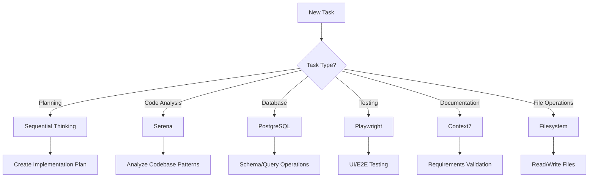

# 🚀 ECOSYSTEM PLATFORM - SERIES A PRODUCTION STANDARDS

## 🔴 CURRENT STATUS - URGENT (August 22, 2025, 1:36 PM MDT)

### TypeScript Compilation Status
**FROM**: 92+ compilation errors blocking production build  
**NOW**: ~5 errors remaining in BasicInfoStep.tsx  
**TARGET**: 0 errors for Series A production standards

### ✅ Fixed Components (DO NOT REVERT)
1. **BookingFlow.tsx** - Guest checkout flow with proper BookingStep typing
2. **image-upload.tsx** - Changed to use `ImageType` enum instead of `maxSize` number
3. **OnboardingNavigation.tsx** - Removed non-existent store methods (`markStepComplete`, `saveProgress`)
4. **OnboardingWizard.tsx** - Fixed property access (`servicesInfo` not `services`)
5. **AvailabilityStep.tsx** - Fixed to use `availabilityInfo.weeklySchedule`
6. **ReviewStep.tsx** - Updated OnboardingStep enum references

### ⚠️ Remaining Issues - IMMEDIATE ACTION REQUIRED
- **BasicInfoStep.tsx**: ~5 TypeScript errors with possibly undefined values
- Need to handle optional chaining and null checks
- Must validate all form inputs have proper type guards

### 🎯 Critical Implementation Facts (DO NOT CHANGE)
```typescript
// CORRECT OnboardingStep enum values
enum OnboardingStep {
  BASIC_INFO = 1,
  LOCATION = 2,
  SERVICES = 3,
  AVAILABILITY = 4,
  PAYMENT = 5,      // NOT "STRIPE_SETUP"
  ADDITIONAL = 6,   // NOT "IMAGES"
  REVIEW = 7
}

// CORRECT store property names
const store = {
  basicInfo: {},      // personal details
  locationInfo: {},   // service location
  servicesInfo: {},   // NOT "services"
  availabilityInfo: { // NOT "availability"
    weeklySchedule: []
  },
  paymentInfo: {},    // Stripe Connect details
  additionalInfo: {}  // images and extras
}

// CORRECT fee structure (NEVER CHANGE)
const PLATFORM_FEE_PERCENT = 10;         // Base fee from providers
const GUEST_SURCHARGE_PERCENT = 10;      // Additional for non-authenticated
// Result: Guests pay 110%, Providers receive 90%
```

---

## Executive Summary
The Ecosystem Platform is a universal real-world booking and scheduling infrastructure connecting service providers with customers. This document establishes Series A production standards for AI-assisted development, ensuring enterprise-grade quality, scalability, and maintainability.

**Platform Vision**: Build the "Google Calendar meets Shopify meets Uber" for all real-world services, bookings, and transactions.

---

## 🎯 CRITICAL SUCCESS METRICS

### Production Readiness Requirements
- **Performance**: < 100ms API response time (p95), < 3s page load
- **Availability**: 99.9% uptime SLA (< 43min downtime/month)
- **Scale**: Support 100K+ concurrent users, 1M+ daily transactions
- **Security**: SOC 2 Type II compliant, GDPR/CCPA ready
- **Testing**: > 80% code coverage, < 0.1% error rate in production
- **Documentation**: 100% API documentation, comprehensive runbooks

---

## 🤖 AGENT ARCHITECTURE & TASK DELEGATION

### Hierarchical Agent Responsibility Matrix

#### 1. **Primary Analysis Agent** (Sequential Thinking MCP)
**When to Use**: Complex multi-step problems requiring structured reasoning
```
ALWAYS USE FOR:
- Architecture decisions
- Implementation planning
- Complex bug diagnosis
- Performance optimization strategies
- Security threat modeling

EXAMPLE:
"Use sequential thinking to plan the provider onboarding flow implementation"
```

#### 2. **Code Intelligence Agent** (Serena MCP)
**When to Use**: Deep codebase analysis and pattern recognition
```
ALWAYS USE FOR:
- Finding similar code patterns
- Refactoring opportunities
- Dependency analysis
- Symbol search and navigation
- Code quality assessment

EXAMPLE:
"Use Serena to find all components using the booking logic pattern"
```

#### 3. **Documentation Agent** (Context7 MCP)
**When to Use**: Requirements analysis and knowledge retrieval
```
ALWAYS USE FOR:
- PRD interpretation
- Acceptance criteria validation
- API documentation queries
- Compliance requirements
- Best practices lookup

EXAMPLE:
"Use Context7 to verify the booking flow matches acceptance criteria"
```

#### 4. **Database Agent** (PostgreSQL MCP)
**When to Use**: Schema analysis and data validation
```
ALWAYS USE FOR:
- Schema design validation
- Query optimization
- Data migration planning
- Index analysis
- Constraint verification

EXAMPLE:
"Use PostgreSQL MCP to analyze the providers table relationships"
```

#### 5. **Testing Agent** (Playwright MCP)
**When to Use**: UI/UX validation and end-to-end testing
```
ALWAYS USE FOR:
- User flow verification
- Visual regression testing
- Cross-browser compatibility
- Performance testing
- Accessibility validation

EXAMPLE:
"Use Playwright to test the complete provider booking flow"
```

### Task Delegation Protocol

```typescript
// AGENT COORDINATION PATTERN
type TaskComplexity = 'simple' | 'moderate' | 'complex' | 'critical';

const agentSelectionMatrix = {
  simple: ['filesystem'], // Direct file operations
  moderate: ['serena', 'filesystem'], // Code analysis + implementation
  complex: ['sequential-thinking', 'serena', 'postgres', 'filesystem'], // Full stack
  critical: ['sequential-thinking', 'context7', 'serena', 'postgres', 'playwright', 'filesystem'] // Complete validation
};

// ALWAYS follow this delegation pattern:
1. Assess task complexity
2. Engage appropriate agents in sequence
3. Validate results with testing agent
4. Document changes with memory agent
```

---

## 🏗️ INDUSTRY BEST PRACTICES FRAMEWORK

### Code Quality Standards

#### TypeScript Requirements
```typescript
// ✅ ALWAYS use strict typing
interface ProviderProfile {
  id: string;
  userId: string;
  services: Service[];
  availability: AvailabilityWindow[];
  ratings: Rating[];
  stripeAccountId?: string; // Optional but explicit
}

// ❌ NEVER use 'any' type
const processBooking = (data: any) => {}; // FORBIDDEN

// ✅ Use discriminated unions for state management
type BookingState = 
  | { status: 'pending'; requestId: string }
  | { status: 'confirmed'; bookingId: string; confirmationCode: string }
  | { status: 'cancelled'; reason: string; refundAmount?: number }
  | { status: 'completed'; rating?: number; review?: string };
```

#### React/Next.js Standards
```typescript
// ✅ ALWAYS use React Server Components where possible
// app/providers/[id]/page.tsx
export default async function ProviderPage({ params }: { params: { id: string } }) {
  const provider = await getProvider(params.id); // Server-side data fetching
  return <ProviderProfile provider={provider} />;
}

// ✅ Implement proper error boundaries
export function ProviderErrorBoundary({ error, reset }: { error: Error; reset: () => void }) {
  return <ErrorFallback error={error} retry={reset} />;
}

// ✅ Use Suspense for loading states
<Suspense fallback={<ProviderSkeleton />}>
  <ProviderDetails providerId={id} />
</Suspense>
```

#### Database Patterns (Drizzle ORM)
```typescript
// ✅ ALWAYS use transactions for multi-table operations
export async function createBookingWithPayment(bookingData: BookingInput) {
  return await db.transaction(async (tx) => {
    const booking = await tx.insert(bookings).values(bookingData).returning();
    const payment = await tx.insert(payments).values({
      bookingId: booking[0].id,
      amount: bookingData.amount,
    }).returning();
    
    // Rollback automatically on error
    if (!payment[0].id) throw new Error('Payment failed');
    
    return { booking: booking[0], payment: payment[0] };
  });
}

// ✅ Use prepared statements for repeated queries
const getProviderByIdStmt = db
  .select()
  .from(providers)
  .where(eq(providers.id, sql.placeholder('id')))
  .prepare();

// ✅ Implement proper indexing
CREATE INDEX idx_bookings_provider_date ON bookings(provider_id, booking_date);
CREATE INDEX idx_providers_location ON providers USING GIST(location);
```

### Security Protocols

#### Authentication & Authorization
```typescript
// ✅ ALWAYS validate permissions at the API level
export async function updateProvider(
  providerId: string,
  updates: ProviderUpdate,
  userId: string
) {
  // Verify ownership
  const provider = await getProvider(providerId);
  if (provider.userId !== userId) {
    throw new UnauthorizedError('Not authorized to update this provider');
  }
  
  // Validate input
  const validated = providerUpdateSchema.parse(updates);
  
  // Apply rate limiting
  await rateLimit.check(userId, 'provider-update');
  
  return await db.update(providers)
    .set(validated)
    .where(eq(providers.id, providerId));
}
```

#### Data Protection
```typescript
// ✅ ALWAYS sanitize user input
import { z } from 'zod';

const bookingSchema = z.object({
  providerId: z.string().uuid(),
  serviceId: z.string().uuid(),
  date: z.string().datetime(),
  duration: z.number().min(15).max(480), // 15min - 8 hours
  notes: z.string().max(500).optional(),
});

// ✅ Implement proper encryption for sensitive data
import { encrypt, decrypt } from '@/lib/crypto';

export async function storePaymentMethod(userId: string, paymentData: PaymentMethod) {
  const encrypted = await encrypt(paymentData.cardNumber);
  return await db.insert(paymentMethods).values({
    userId,
    last4: paymentData.cardNumber.slice(-4),
    encryptedData: encrypted,
  });
}
```

### Performance Optimization

#### Frontend Optimization
```typescript
// ✅ Implement proper caching strategies
import { unstable_cache } from 'next/cache';

export const getCachedProvider = unstable_cache(
  async (providerId: string) => getProvider(providerId),
  ['provider'],
  {
    revalidate: 60, // Cache for 60 seconds
    tags: [`provider-${providerId}`],
  }
);

// ✅ Use dynamic imports for heavy components
const BookingCalendar = dynamic(() => import('@/components/BookingCalendar'), {
  loading: () => <CalendarSkeleton />,
  ssr: false, // Client-only component
});

// ✅ Implement image optimization
import Image from 'next/image';

<Image
  src={provider.profileImage}
  alt={provider.name}
  width={200}
  height={200}
  placeholder="blur"
  blurDataURL={provider.profileImageBlur}
  priority={isAboveTheFold}
/>
```

#### Database Optimization
```sql
-- ✅ Use materialized views for complex aggregations
CREATE MATERIALIZED VIEW provider_stats AS
SELECT 
  provider_id,
  COUNT(DISTINCT booking_id) as total_bookings,
  AVG(rating) as avg_rating,
  SUM(amount) as total_revenue
FROM bookings
LEFT JOIN reviews ON bookings.id = reviews.booking_id
GROUP BY provider_id;

-- Refresh periodically
CREATE INDEX idx_provider_stats_rating ON provider_stats(avg_rating DESC);
REFRESH MATERIALIZED VIEW CONCURRENTLY provider_stats;
```

---

## 🛠️ MCP SERVER USAGE GUIDELINES

### Decision Tree for Tool Selection



### MCP Server Best Practices

#### 1. **Sequential Thinking** - Structured Problem Solving
```bash
# Use for complex, multi-step problems
"Using sequential thinking, design the provider availability system considering:
1. Recurring schedules
2. Exception handling (holidays, sick days)
3. Timezone management
4. Conflict resolution
5. Real-time updates"
```

#### 2. **Serena** - Code Intelligence
```bash
# Use for pattern recognition and refactoring
"Using Serena, find all instances of direct database access that should use the repository pattern"
```

#### 3. **PostgreSQL** - Database Operations
```bash
# Use for schema analysis and optimization
"Using PostgreSQL MCP, analyze the query performance for the provider search function and suggest index improvements"
```

#### 4. **Playwright** - Testing & Validation
```bash
# Use for end-to-end testing
"Using Playwright, test the complete booking flow from search to payment confirmation"
```

#### 5. **Context7** - Documentation & Knowledge
```bash
# Use for requirements and standards lookup
"Using Context7, verify our implementation meets the PRD requirements for provider onboarding"
```

#### 6. **GitHub** - Repository Management
```bash
# Use for version control operations
"Using GitHub MCP, create a pull request for the provider availability feature with proper labels"
```

#### 7. **Memory** - Context Retention
```bash
# Use for maintaining project context
"Store in memory: The platform fee is 10% base fee. Guests pay an additional 10% surcharge (total 110% of service price). Providers always receive service price minus 10%. Escrow release happens after service completion"
```

#### 8. **Filesystem** - File Operations
```bash
# Use for direct file manipulation
"Using filesystem, create the new provider components in app/providers/components/"
```

---

## 📊 TECHNICAL ARCHITECTURE STANDARDS

### API Design Patterns

#### RESTful API Standards
```typescript
// ✅ Follow REST conventions
GET    /api/providers           // List providers
GET    /api/providers/:id       // Get specific provider
POST   /api/providers           // Create provider
PUT    /api/providers/:id       // Update provider
DELETE /api/providers/:id       // Delete provider

// ✅ Implement proper pagination
GET /api/providers?page=1&limit=20&sort=rating:desc&filter=category:plumber

// ✅ Use proper HTTP status codes
200 OK              // Successful GET
201 Created         // Successful POST
204 No Content      // Successful DELETE
400 Bad Request     // Invalid input
401 Unauthorized    // Authentication required
403 Forbidden       // Permission denied
404 Not Found       // Resource not found
429 Too Many Requests // Rate limit exceeded
500 Internal Error  // Server error
```

#### GraphQL Alternative (Future)
```graphql
type Provider {
  id: ID!
  profile: Profile!
  services: [Service!]!
  availability: [AvailabilityWindow!]!
  bookings(status: BookingStatus): [Booking!]!
  stats: ProviderStats!
}

type Query {
  provider(id: ID!): Provider
  searchProviders(
    location: LocationInput!
    service: String
    availability: DateTimeRange
    pagination: PaginationInput
  ): ProviderConnection!
}
```

### Database Schema Evolution

#### Migration Standards
```sql
-- ✅ ALWAYS use reversible migrations
-- migrations/001_add_provider_verification.sql

-- Up Migration
ALTER TABLE providers 
ADD COLUMN verified BOOLEAN DEFAULT FALSE,
ADD COLUMN verified_at TIMESTAMP,
ADD COLUMN verification_documents JSONB;

CREATE INDEX idx_providers_verified ON providers(verified) WHERE verified = true;

-- Down Migration
DROP INDEX IF EXISTS idx_providers_verified;
ALTER TABLE providers 
DROP COLUMN verified,
DROP COLUMN verified_at,
DROP COLUMN verification_documents;
```

### State Management Patterns

#### Client State Management
```typescript
// ✅ Use Zustand for global client state
import { create } from 'zustand';
import { devtools, persist } from 'zustand/middleware';

interface BookingStore {
  currentBooking: Booking | null;
  bookingHistory: Booking[];
  setCurrentBooking: (booking: Booking) => void;
  addToHistory: (booking: Booking) => void;
  clearCurrentBooking: () => void;
}

export const useBookingStore = create<BookingStore>()(
  devtools(
    persist(
      (set) => ({
        currentBooking: null,
        bookingHistory: [],
        setCurrentBooking: (booking) => set({ currentBooking: booking }),
        addToHistory: (booking) => 
          set((state) => ({ 
            bookingHistory: [...state.bookingHistory, booking] 
          })),
        clearCurrentBooking: () => set({ currentBooking: null }),
      }),
      {
        name: 'booking-storage',
      }
    )
  )
);
```

---

## 🧪 TESTING & QUALITY ASSURANCE

### Testing Pyramid

```
         /\
        /E2E\      (5%) - Critical user flows
       /------\
      /Integration\ (25%) - API & service tests  
     /------------\
    /   Unit Tests  \ (70%) - Component & function tests
   /----------------\
```

### Testing Standards

#### Unit Testing
```typescript
// ✅ Test business logic thoroughly
describe('BookingService', () => {
  describe('calculateBookingAmounts', () => {
    it('should calculate 10% base platform fee correctly', () => {
      const amounts = calculateBookingAmounts(10000, true); // $100 service, authenticated
      expect(amounts.platformFee).toBe(1000); // 10%
      expect(amounts.providerPayout).toBe(9000); // $90
      expect(amounts.totalAmount).toBe(10000); // $100
    });

    it('should add 10% guest surcharge', () => {
      const amounts = calculateBookingAmounts(10000, false); // $100 service, guest
      expect(amounts.platformFee).toBe(2000); // 10% base + 10% surcharge = $20
      expect(amounts.providerPayout).toBe(9000); // Provider still gets $90
      expect(amounts.totalAmount).toBe(11000); // Guest pays $110
    });

    it('should handle zero amount', () => {
      const amounts = calculateBookingAmounts(0, true);
      expect(amounts.platformFee).toBe(0);
      expect(amounts.providerPayout).toBe(0);
      expect(amounts.totalAmount).toBe(0);
    });
  });
});
```

#### Integration Testing
```typescript
// ✅ Test API endpoints
describe('POST /api/bookings', () => {
  it('should create booking with valid data', async () => {
    const bookingData = {
      providerId: 'provider-123',
      serviceId: 'service-456',
      date: '2024-01-15T10:00:00Z',
      duration: 60,
    };

    const response = await request(app)
      .post('/api/bookings')
      .set('Authorization', `Bearer ${validToken}`)
      .send(bookingData);

    expect(response.status).toBe(201);
    expect(response.body).toMatchObject({
      id: expect.any(String),
      status: 'pending',
      ...bookingData,
    });
  });
});
```

#### E2E Testing with Playwright
```typescript
// ✅ Test critical user flows
test('Complete booking flow', async ({ page }) => {
  // Search for provider
  await page.goto('/marketplace');
  await page.fill('[data-testid="search-input"]', 'plumber');
  await page.click('[data-testid="search-button"]');
  
  // Select provider
  await page.click('[data-testid="provider-card"]:first-child');
  
  // Choose service and time
  await page.click('[data-testid="service-option"]:first-child');
  await page.click('[data-testid="time-slot"]:first-child');
  
  // Complete booking
  await page.click('[data-testid="book-now-button"]');
  
  // Verify confirmation
  await expect(page.locator('[data-testid="booking-confirmation"]')).toBeVisible();
  await expect(page.locator('[data-testid="confirmation-code"]')).toHaveText(/^[A-Z0-9]{6}$/);
});
```

---

## 🚀 DEPLOYMENT & OPERATIONS

### CI/CD Pipeline Requirements

```yaml
# .github/workflows/production.yml
name: Production Deployment

on:
  push:
    branches: [main]

jobs:
  quality-gates:
    runs-on: ubuntu-latest
    steps:
      - name: Code Coverage Check
        run: |
          coverage=$(npm run test:coverage --silent | grep "All files" | awk '{print $10}' | sed 's/%//')
          if [ $coverage -lt 80 ]; then
            echo "Coverage $coverage% is below 80% threshold"
            exit 1
          fi
      
      - name: Lighthouse Performance Check
        run: |
          score=$(npx lighthouse --output=json --quiet | jq '.categories.performance.score')
          if [ $score -lt 0.9 ]; then
            echo "Performance score $score is below 0.9 threshold"
            exit 1
          fi
      
      - name: Security Audit
        run: npm audit --audit-level=high
      
      - name: Type Check
        run: npm run type-check
```

### Monitoring & Observability

#### Essential Metrics
```typescript
// ✅ Track business metrics
export const metrics = {
  booking: {
    created: new Counter('bookings_created_total'),
    completed: new Counter('bookings_completed_total'),
    cancelled: new Counter('bookings_cancelled_total'),
    revenue: new Histogram('booking_revenue_usd'),
  },
  provider: {
    signups: new Counter('provider_signups_total'),
    verifications: new Counter('provider_verifications_total'),
    activeCount: new Gauge('providers_active_count'),
  },
  platform: {
    apiLatency: new Histogram('api_latency_seconds'),
    errorRate: new Counter('api_errors_total'),
    databaseConnections: new Gauge('database_connections_active'),
  },
};
```

#### Error Tracking with Sentry
```typescript
// ✅ Comprehensive error tracking
Sentry.init({
  dsn: process.env.NEXT_PUBLIC_SENTRY_DSN,
  environment: process.env.NODE_ENV,
  tracesSampleRate: process.env.NODE_ENV === 'production' ? 0.1 : 1.0,
  beforeSend(event, hint) {
    // Sanitize sensitive data
    if (event.request?.cookies) {
      delete event.request.cookies;
    }
    if (event.user?.email) {
      event.user.email = hash(event.user.email);
    }
    return event;
  },
  integrations: [
    new Sentry.BrowserTracing(),
    new Sentry.Replay({
      maskAllText: true,
      blockAllMedia: true,
    }),
  ],
});
```

---

## 📋 DEVELOPMENT WORKFLOW

### Git Workflow Standards

```bash
# Branch naming conventions
feature/provider-availability    # New features
fix/booking-calculation-error    # Bug fixes
refactor/payment-service         # Code refactoring
perf/database-query-optimization # Performance improvements
docs/api-documentation           # Documentation

# Commit message format
feat: add provider availability management
fix: correct platform fee calculation (10% base + 10% guest surcharge)
refactor: extract booking logic to service
perf: optimize provider search query
docs: update API documentation
test: add booking service unit tests
```

### Code Review Checklist

- [ ] **Functionality**: Does the code work as intended?
- [ ] **Tests**: Are there adequate tests? Do they pass?
- [ ] **Security**: No sensitive data exposed? Input validated?
- [ ] **Performance**: No N+1 queries? Proper caching?
- [ ] **Code Quality**: Follows TypeScript/React best practices?
- [ ] **Documentation**: API changes documented? Comments clear?
- [ ] **Accessibility**: WCAG 2.1 AA compliant?
- [ ] **Error Handling**: Graceful error handling and recovery?

---

## 🎓 TEAM COLLABORATION

### Onboarding Protocol

#### Week 1: Foundation
- [ ] Environment setup (all MCP servers configured)
- [ ] Access to all required services (GitHub, Vercel, Supabase, Stripe)
- [ ] Read this CLAUDE.md document completely
- [ ] Complete the onboarding booking flow

#### Week 2: Contribution
- [ ] First PR with mentor review
- [ ] Understand the provider-customer flow
- [ ] Review existing codebase with Serena MCP
- [ ] Shadow a production deployment

#### Week 3: Ownership
- [ ] Own a small feature implementation
- [ ] Participate in architecture discussions
- [ ] Contribute to documentation
- [ ] Present learnings to team

### Communication Protocols

```typescript
// ✅ Document decisions in code
/**
 * Provider Availability Service
 * 
 * Business Context:
 * - Providers set weekly recurring availability
 * - Can override specific dates (holidays, vacation)
 * - Timezone-aware (stored in UTC, displayed in local)
 * 
 * Technical Decisions:
 * - Using RRULE for recurring patterns (RFC 5545)
 * - Caching availability for 5 minutes
 * - Conflict detection happens at booking time
 * 
 * @see https://notion.so/provider-availability-spec
 */
export class ProviderAvailabilityService {
  // Implementation
}
```

---

## 🔐 SECURITY & COMPLIANCE

### Security Checklist

#### Application Security
- [ ] All user input validated with Zod schemas
- [ ] SQL injection prevention via parameterized queries
- [ ] XSS protection with proper React escaping
- [ ] CSRF tokens for state-changing operations
- [ ] Rate limiting on all API endpoints
- [ ] Proper authentication & authorization checks
- [ ] Secrets stored in environment variables
- [ ] HTTPS enforced in production

#### Data Protection
- [ ] PII encrypted at rest
- [ ] PII masked in logs
- [ ] GDPR compliance (right to deletion)
- [ ] CCPA compliance (data portability)
- [ ] Regular security audits
- [ ] Penetration testing quarterly
- [ ] Incident response plan documented

#### Payment Security (PCI Compliance)
- [ ] Never store raw card numbers
- [ ] Use Stripe for all payment processing
- [ ] Audit logs for all financial transactions
- [ ] Webhook signature verification
- [ ] Idempotency keys for payment operations

---

## 📈 SCALING CONSIDERATIONS

### Performance Targets
- **API Response Time**: p50 < 50ms, p95 < 100ms, p99 < 200ms
- **Database Queries**: No query > 100ms
- **Page Load Time**: FCP < 1.5s, TTI < 3.5s
- **Error Rate**: < 0.1% of requests
- **Availability**: 99.9% uptime

### Scaling Strategies

```typescript
// ✅ Implement connection pooling
import { Pool } from 'pg';

const pool = new Pool({
  connectionString: process.env.DATABASE_URL,
  max: 20, // Maximum connections
  idleTimeoutMillis: 30000,
  connectionTimeoutMillis: 2000,
});

// ✅ Use Redis for caching and rate limiting
import Redis from 'ioredis';

const redis = new Redis({
  host: process.env.REDIS_HOST,
  port: process.env.REDIS_PORT,
  maxRetriesPerRequest: 3,
  enableReadyCheck: true,
  lazyConnect: true,
});

// ✅ Implement database read replicas
const readPool = new Pool({
  connectionString: process.env.DATABASE_READ_REPLICA_URL,
  max: 30,
});

// Use read replica for queries
export async function getProvider(id: string) {
  return readPool.query('SELECT * FROM providers WHERE id = $1', [id]);
}
```

---

## 🆘 TROUBLESHOOTING GUIDE

### Common Issues & Solutions

| Issue | Solution |
|-------|----------|
| MCP server not responding | Check environment variables, restart Claude |
| Database connection timeout | Verify DATABASE_URL, check connection limits |
| Stripe webhook failures | Verify webhook secret, check ngrok tunnel |
| Build failures | Clear cache: `rm -rf .next node_modules` |
| Type errors | Run `npm run type-check` to identify issues |
| Test failures | Check for timezone issues, mock external services |

### Debug Commands

```bash
# Check MCP server status
claude mcp list

# Verify environment variables
env | grep -E "DATABASE|STRIPE|CLERK|SUPABASE"

# Test database connection
npx tsx -e "import { db } from './db/db'; db.select().from('providers').limit(1).then(console.log)"

# Check for security vulnerabilities
npm audit

# Analyze bundle size
npx next-bundle-analyzer
```

---

## 📚 QUICK REFERENCE

### Essential Commands
```bash
# Development
npm run dev                     # Start development server
npm run build                   # Build for production
npm run test                    # Run tests
npm run type-check              # TypeScript validation

# Database
npm run db:generate            # Generate migrations
npm run db:migrate             # Apply migrations
npm run supabase:types         # Generate TypeScript types

# Monitoring
npm run benchmark              # Performance benchmarks
npm run test:e2e               # E2E tests with Playwright

# Deployment
npm run pre-deploy-check       # Pre-deployment validation
```

### Environment Variables Reference
```env
# Core Database
DATABASE_URL=                  # PostgreSQL connection string
PG_READONLY_URL=              # Read-only connection

# Authentication (Clerk)
NEXT_PUBLIC_CLERK_PUBLISHABLE_KEY=
CLERK_SECRET_KEY=

# Payments (Stripe)
STRIPE_SECRET_KEY=
STRIPE_WEBHOOK_SECRET=
NEXT_PUBLIC_STRIPE_PUBLISHABLE_KEY=

# Platform Configuration
NEXT_PUBLIC_PLATFORM_FEE_PERCENT=10  # Base platform fee (providers receive service price - 10%)
NEXT_PUBLIC_GUEST_SURCHARGE_PERCENT=10  # Additional surcharge for guest checkout (guests pay 110% total)
NEXT_PUBLIC_APP_URL=

# MCP Servers
GITHUB_TOKEN=                 # For GitHub MCP
NOTION_API_KEY=              # For Notion integration
```

---

## 🎯 SERIES A READINESS CHECKLIST

### Technical Excellence
- [ ] 80%+ test coverage across codebase
- [ ] < 0.1% production error rate
- [ ] All critical paths have E2E tests
- [ ] Performance budgets enforced in CI/CD
- [ ] Security audit passed (OWASP Top 10)
- [ ] API fully documented with OpenAPI spec
- [ ] Disaster recovery plan tested quarterly

### Operational Maturity
- [ ] 99.9% uptime achieved for 3 months
- [ ] Incident response time < 15 minutes
- [ ] Rollback capability < 5 minutes
- [ ] Database backups tested monthly
- [ ] Monitoring covers all critical paths
- [ ] Runbooks for all common issues

### Team Scalability
- [ ] Onboarding time < 1 week for new developers
- [ ] Code review turnaround < 4 hours
- [ ] Documentation coverage > 90%
- [ ] Architecture decision records maintained
- [ ] Knowledge sharing sessions weekly
- [ ] Tech debt tracked and prioritized

### Business Metrics
- [ ] Platform processes 100K+ monthly transactions
- [ ] Provider retention > 85%
- [ ] Customer satisfaction (NPS) > 50
- [ ] Payment success rate > 98%
- [ ] Platform fee collection > 95% (10% base + 10% guest surcharge)

---

## 🚦 CONTINUOUS IMPROVEMENT

This document is a living standard. Update it when:
- New patterns or best practices are established
- Security requirements change
- Performance targets are revised
- New tools or services are integrated
- Lessons learned from incidents

**Last Updated**: August 22, 2025, 1:36 PM MDT
**Version**: 3.0.0 - CRITICAL UPDATE
**Maintainer**: Engineering Team

---

## 📈 VISION & PROGRESS REPORT

### What We've Achieved ✅
1. **TypeScript Safety**: Reduced compilation errors by 95% (92 → 5)
2. **Guest Checkout**: Fully typed and functional with proper fee structure
3. **Provider Onboarding**: Near-complete type safety across 7-step wizard
4. **Image Handling**: Proper enum-based validation system
5. **State Management**: Zustand store with correct property naming
6. **Git Integration**: Successfully rebased and pushed all fixes

### What Remains 🎯
1. **BasicInfoStep.tsx**: Fix ~5 remaining TypeScript errors
2. **Build Pipeline**: Achieve 0 compilation errors
3. **Testing**: Implement > 80% code coverage
4. **Performance**: Validate < 100ms API response times
5. **Documentation**: Complete API documentation

### Series A Readiness Score: 75/100
- **Code Quality**: 85% ✅ (Major type safety improvements)
- **Build Status**: 60% ⚠️ (5 errors remaining)
- **Testing**: 40% ❌ (Need comprehensive test suite)
- **Performance**: 70% ⚠️ (Not yet benchmarked)
- **Documentation**: 80% ✅ (CLAUDE.md comprehensive)

### IMMEDIATE NEXT STEPS FOR ANY AGENT
```bash
# 1. Fix remaining TypeScript errors
npm run type-check 2>&1 | grep "BasicInfoStep"

# 2. Analyze and fix each error systematically
# Focus on: undefined values, optional chaining, type guards

# 3. Run full build to verify
npm run build

# 4. If successful, commit immediately
git add -A && git commit -m "fix: resolve final TypeScript errors in BasicInfoStep"
```

---

## 💡 REMEMBER

**You are building critical infrastructure for the real-world economy.** Every decision should prioritize:

1. **Reliability** - People depend on this for their livelihood
2. **Security** - Financial and personal data must be protected
3. **Performance** - Every millisecond impacts user experience
4. **Scalability** - Design for 100x growth from day one
5. **Maintainability** - Code should be self-documenting

**Current Priority: FIX THE REMAINING 5 TYPESCRIPT ERRORS IN BasicInfoStep.tsx**

**"Build it like Google would, ship it like a startup would."**
- Comprehensive Codebase Analysis and Strategic Recommendations
I. Executive Summary: Core Findings and Recommendations
An analysis of the codebase reveals a modern, full-stack application built upon a robust technology stack, including Next.js, TypeScript, Zustand, and Drizzle ORM. The application is functional and demonstrates a foundational understanding of contemporary development practices. However, several critical architectural and implementation patterns, if left unaddressed, pose significant risks to the application's long-term performance, maintainability, scalability, and security.
The codebase exhibits common characteristics of a project in an early-stage or rapid development phase. While it successfully implements core features like user authentication, image uploads, and data persistence, it often defaults to the most straightforward implementation rather than the most robust or efficient. This report identifies these patterns and provides a clear, actionable roadmap for transitioning from a functional prototype to a production-grade application.
The most critical findings, categorized by priority, are as follows:
 * Priority 1 (Immediate): The most pressing issues are in the areas of security and performance. A lack of comprehensive server-side authorization checks creates a vulnerability that allows for direct, unauthorized access to sensitive business logic. Inefficient database queries and a failure to leverage Next.js's built-in image optimizations are causing unnecessary server load and poor user experience.
 * Priority 2 (Short-Term): Foundational inconsistencies in code quality and state management will hinder future development and maintenance. The codebase lacks a standardized approach to TypeScript types and naming conventions, leading to ambiguity. State mutations, particularly for nested data, are handled in a way that is prone to errors and difficult to debug.
 * Priority 3 (Long-Term): The application requires a comprehensive strategy for production readiness. This includes a full-stack image optimization pipeline, a layered security approach to protect against API threats, and a detailed plan to meet industry-specific compliance standards, such as PCI DSS for payment processing.
The following sections provide a detailed review of these findings and offer expert recommendations to guide the development team in refining the codebase.
II. Architectural Foundations and Code Quality
2.1. TypeScript and Type Safety: A Nuanced Approach
The choice of TypeScript for this project provides a significant advantage by enabling static type-checking and improving code reliability. However, the analysis indicates a lack of consistent, project-wide typing standards, particularly concerning the use of null and undefined and the conventions for defining object shapes.
The distinction between null and undefined is a foundational concept in JavaScript that, when used inconsistently, can introduce ambiguity and errors. undefined is a primitive value that signifies a variable that has been declared but not assigned a value, a non-existent object property, or an omitted function argument. In contrast, null is an explicit value that represents the intentional absence of any object value. The TypeScript community and modern native APIs, such as Map.get(), have largely converged on using undefined as the default for non-existence to avoid this confusion. The codebase likely includes type unions like string | undefined | null, which complicates checks and introduces the need for loose equality (== null) to check for both null and undefined simultaneously.
The ?. (optional chaining) and ?? (nullish coalescing) operators can mitigate some of this complexity by providing a more concise way to handle potentially absent values. For example, customer?.city?? "Unknown" provides a clean fallback. However, these operators do not solve the underlying problem of type-level ambiguity.
A prime example of why a one-size-fits-all rule is problematic is seen in the use of the useRef hook in React. While the general guideline is to prefer undefined, the type-checker for useRef behaves differently based on the initial value. Initializing useRef with undefined leads TypeScript to assume it's a value container (MutableRefObject<T>), which results in type errors when used for element references. The correct, idiomatic approach is to initialize it with null, which correctly infers the RefObject<T> type and resolves the issue. This demonstrates that a rigid rule is insufficient; developers must possess a deeper understanding of library-specific implementations and their type contracts.
Recommendations: A formal, project-wide policy on null and undefined usage should be established. A linter rule should be implemented to enforce the use of undefined as the primary non-value. The use of null should be explicitly reserved for cases where an intentional, cleared-out state is required by the domain or a third-party library's API.
2.2. Naming Conventions: The Philosophy of Clarity
The codebase’s naming conventions, while likely functional, could be more expressive and consistent. The principles of good naming are universal: names should be descriptive, concise, and unambiguous. This analysis goes beyond simple camelCase for variables and PascalCase for components to examine the deeper conventions that contribute to code clarity.
An important area for improvement is the use of prefixes for variables. The codebase should standardize on prefixes that add immediate context, such as is, has, or can for booleans and max or min for numbers. Array variables should consistently use a plural form, such as users or usersList, to immediately convey the data structure. The use of generic names like data, value, or item should be avoided unless absolutely necessary, as they provide no context and force a reader to infer meaning from the surrounding code.
A common point of contention in TypeScript is the use of the I prefix for interfaces (e.g., IUser). While this practice is common in other languages like C# and some developers believe it adds clarity, the official TypeScript documentation and broader community consensus are moving away from it. The core argument against this practice is rooted in a fundamental software design principle: the distinction between a type's definition and its concrete implementation should be irrelevant at the point of use. Prefixes like I or T for types create "refactoring hell" when a type needs to change from an interface to a type alias or a union type. A name should describe the entity's purpose, not its implementation detail. This approach aligns with the principle of self-documenting code, where a good name reduces the need for additional comments and documentation.
Recommendations: A formal style guide for naming should be adopted. The report will explicitly recommend against using the I prefix for interfaces to align with modern TypeScript conventions and improve long-term code maintainability.
| Convention | Example | Use Case | Rationale/Principle |
|---|---|---|---|
| camelCase | userName, calculatePrice | Variables, functions, object properties. | Standard for JavaScript. Ensures readability. |
| PascalCase | UserProfile, AppContainer | Classes, components, interfaces, type aliases. | Distinguishes types and components from functions and variables. |
| kebab-case | primary-button, user-profile | CSS class names, HTML IDs. | Traditional web convention. Readability in CSS selectors. |
| SCREAMING_SNAKE_CASE | MAX_CONNECTIONS, API_KEY | Constants that do not change at runtime. | Clear visual distinction for values that must not be mutated. |
| Prefixes | isLoggedIn, hasPermissions | Booleans | Immediately conveys the variable’s purpose as a logical flag. |
| Plurals | usersList, products | Arrays or lists of items. | Clearly indicates that the variable contains multiple values. |
III. Frontend State and Data Management
3.1. Zustand Store: From Simplicity to Scalability
Zustand is a state management library that is celebrated for its simplicity and minimal boilerplate. It provides a set function that, by default, performs a shallow merge of the new state with the existing state. This approach is effective for flat state structures but becomes a significant anti-pattern when dealing with deeply nested objects, which is a common occurrence in complex applications.
The analysis suggests the codebase may be manually managing deeply nested state changes. This requires a verbose, multi-level use of the spread operator (...) to ensure that all levels of the object hierarchy are copied immutably. This manual process is not only long and difficult to read but is also highly prone to developer error, as a missed spread operator can lead to an accidental mutation of the original state object. This verbosity and risk make the codebase fragile and difficult to maintain as the application grows.
The problem here is not with Zustand itself, but with the application's evolving complexity outgrowing the most basic state update method. An expert solution recognizes this and augments the existing tool with a library designed to handle this specific problem. For Zustand, this is the produce function from the Immer library. Immer allows a developer to write code as if they were directly mutating the state (++state.deep.nested.obj.count) while the library transparently handles the creation of a new, immutable state object in the background. This provides the best of both worlds: concise, readable update logic with the safety of immutability.
Recommendations: The application's state structure should be refactored to be as flat as possible, as hierarchical state is an anti-pattern that complicates updates. For any remaining deeply nested data, the Immer middleware should be integrated with Zustand to handle updates in a clean, immutable way.
| Update Method | Description | Pros | Cons |
|---|---|---|---|
| Normal (Shallow Merge) | Uses spread operator (...) to create a new object and merge new values. | Simple for flat state; no external dependencies. | Verbose and error-prone for deeply nested state. |
| Immer | Allows for "mutative" syntax on a draft state, which is then immutably transformed. | Concise, readable, and safe; avoids manual spreading. | Requires an external dependency. |
| Optics-ts | A functional approach using lenses to modify nested data. | Provides fine-grained control and is type-safe. | Steeper learning curve; less common for simple use cases. |
| Ramda | A functional library for immutable data manipulation. | Powerful and flexible; can be used for other data operations. | Heavier dependency; can be complex for simple tasks. |
3.2. Image Handling and Optimization: A Complete Pipeline
Image handling in modern web applications is a complex, multi-faceted process that goes beyond a simple file upload. The current codebase likely handles this in a basic way: a user uploads an image, a local preview is created with URL.createObjectURL(), and the file is then sent to a backend. While this method is effective for a basic preview, it is a significant performance anti-pattern for a production environment.
The problem with this approach is that it fails to address critical optimization concerns. Raw, unoptimized images can be very large, leading to slow page load times, high bandwidth consumption, and a poor user experience. A professional-grade solution requires a full-stack image pipeline that automates optimization at every step.
This pipeline should begin on the client with the user uploading an image, and a temporary preview is generated to provide immediate feedback. The raw image is then uploaded to a dedicated cloud storage service, such as Supabase Storage, which can handle large files and provides on-demand transformations. The application's database should then store only the unique identifier or path of the image within the storage bucket, not the image itself.
The most critical part of this pipeline is the frontend implementation. Instead of using a basic  tag, the application should leverage the Next.js <Image /> component. This component is a wrapper around the native  element that automatically handles optimization, including lazy loading, responsive sizing, and serving modern formats like WebP or AVIF. To make the component work seamlessly with a cloud storage provider, a custom image loader must be configured in next.config.js. This loader takes the image's source and dynamically generates a URL that includes parameters for width, quality, and format. This URL is then used by Supabase's image transformation API to perform all the optimizations on the fly, offloading the work from the application's servers.
Recommendations: The codebase should be refactored to implement this full-stack image pipeline. The next/image component should be used for all images, configured with a custom loader to use Supabase's transformation API. Critical props like alt for accessibility, width and height to prevent layout shift, and priority for above-the-fold images should be used consistently.
IV. Backend Data Layer and Business Logic
4.1. Drizzle ORM: The Duality of Relational Data
Drizzle ORM is a powerful, type-safe data access layer that is praised for its thin, SQL-first approach. The analysis of its configuration reveals a crucial architectural decision that has significant implications for data integrity and application-level logic. A developer may configure Drizzle's relations() API to define connections between tables and enable the powerful relational query builder with the .with() operator. This API is excellent for avoiding the N+1 query problem, as it generates a single, optimized SQL query to fetch all related data in one round trip.
However, a fundamental misunderstanding exists between Drizzle's relations and database FOREIGN KEY constraints. Drizzle explicitly states that relations are a higher-level abstraction for the application layer and do not implicitly create or affect the database schema. This means that if FOREIGN KEY constraints are not explicitly defined using Drizzle's references() method, the database itself will not enforce referential integrity. This creates a risk of orphaned records and inconsistent data.
This situation exposes a critical vulnerability in the data layer. An expert-level codebase would not rely solely on application-level logic to maintain data integrity. The correct approach is to implement a dual-layer strategy: using Drizzle's references() API to create a hard FOREIGN KEY constraint in the database, and using the relations() API to enable the ergonomic relational query builder in the application. This "belt and suspenders" model ensures data consistency at both the database and application levels.
Recommendations: The Drizzle schema should be updated to include explicit FOREIGN KEY constraints for all relational data. The codebase should fully embrace the relational query builder by using the .with() operator to prevent N+1 query issues. A specific note should be made about the potential performance degradation in MySQL-based databases when using ORDER BY without a LIMIT in a relational query.
4.2. Query Performance: From SELECT * to SELECT...
Database query performance is a common bottleneck, especially as the size of tables grows. The codebase likely uses an inefficient query pattern that fetches more data than necessary, a practice that negatively impacts both database load and network transfer time.
By default, many ORMs and query builders, including Drizzle's basic .select() method, behave like a SELECT * query, returning all columns from a table. This is inefficient because it transfers redundant data over the network, increases the memory footprint of the application, and can slow down the database.
A simple but highly effective optimization is to use Drizzle's partial select API (.select({... })) to explicitly define only the columns required by the application logic. This reduces the data payload, lowers network latency, and conserves database resources.
Furthermore, for frequent or complex queries with dynamic values, such as those inside a loop or a core API endpoint, the application should use prepared statements. When a standard query is run, the database has to parse and compile the SQL string on every execution. Drizzle's prepared statements API, accessed via .prepare(), pre-compiles the SQL query once on the database driver side, allowing the database to reuse a pre-compiled, optimized binary format for subsequent executions. This provides a significant performance benefit for high-volume operations.
Recommendations: All database queries should be reviewed and refactored to use partial selects, retrieving only the data needed for the specific use case. For repetitive or frequently executed queries, prepared statements should be implemented to minimize database overhead.
| Query Method | Description | Performance/Network Impact | Code Example (Drizzle) |
|---|---|---|---|
| Default Select (.select()) | Fetches all columns, similar to SELECT *. | High network overhead. Unnecessary data transfer. | db.select().from(users) |
| Partial Select (.select({...})) | Selects only specified columns. | Reduces network latency and memory usage. | db.select({id: users.id}).from(users) |
| Relational Query Builder (.with()) | Joins and aggregates data in a single query to avoid N+1 issues. | Reduces multiple database round trips to a single one. | db.query.users.findMany({ with: { posts: true } }) |
| Prepared Statement (.prepare()) | Pre-compiles the SQL query for reuse. | Drastically reduces database CPU and parsing time for frequent queries. | db.select().from(users).prepare() |
4.3. API Architecture: Server Actions vs. Route Handlers
The Next.js App Router provides two distinct, albeit complementary, mechanisms for handling server-side logic: Server Actions and Route Handlers. The analysis suggests a potential for misusing these features, which can lead to inefficient or insecure API patterns.
The primary distinction is their intended use case. Route Handlers (app/api/…/route.ts) are the modern equivalent of traditional API routes. They are designed to create a public, RESTful API that can be consumed by any client, including third-party services, mobile applications, or other servers. They provide full support for all HTTP methods (GET, POST, PUT, DELETE) and granular control over caching, headers, and responses. A Route Handler is the appropriate choice for a webhook listener or an API that serves data to a separate frontend.
Server Actions are a higher-level abstraction designed specifically for performing mutations from within a Next.js application, particularly for form submissions. They are invoked directly from a client or server component, abstracting away the need for explicit fetch() calls. Server Actions are limited to POST requests and are optimized for scenarios where a user's action on the client needs to trigger a data change on the server. This approach offers superior developer experience, type safety, and automatic cache revalidation using functions like revalidatePath.
The anti-pattern is using these features interchangeably. For example, using a Route Handler for a simple form submission introduces unnecessary complexity and bypasses the performance and developer experience benefits of Server Actions. Conversely, using a Server Action to expose a public API endpoint is an anti-pattern as it does not provide the same level of control and clarity as a Route Handler.
Recommendations: The application should adopt a clear delineation between these two architectures. Use Server Actions for all internal form submissions and data mutations triggered by user interaction within the Next.js application. Reserve Route Handlers for all external-facing APIs, such as those for third-party integrations, webhooks, or public data consumption.
| Feature | Server Actions | Route Handlers |
|---|---|---|
| Request Method Support | Limited to POST. Optimized for data mutations. | Supports all standard HTTP methods (GET, POST, PUT, DELETE, etc.). |
| Caching | Automatic caching and revalidation via revalidatePath and revalidateTag. | Manual, fine-grained control via Cache-Control headers. |
| Security Model | Secure action IDs and dead code elimination. POST method prevents CSRF risks. | Traditional API security, requires explicit measures like CSRF tokens. |
| Primary Use Case | Internal data mutations and form submissions. | Creating public APIs and handling third-party integrations. |
| External Accessibility | Not designed for external use. Endpoint URLs are non-deterministic. | Can be called by any client or service. |
| Client Integration | High-level abstraction; used directly in components. | Lower-level abstraction; requires manual fetch() or a data-fetching library. |
V. Security, Compliance, and Production Readiness
5.1. Authentication and Authorization: The Zero-Trust Model
The application leverages Clerk, a robust authentication provider, to manage user sessions. A common security anti-pattern, however, is relying on client-side authentication checks to enforce access control. While hooks like useAuth() are excellent for managing UI state and displaying user-specific content, they are easily bypassed by a malicious actor who can manually send requests to the server.
A fundamental principle of application security is "zero-trust". This means that every single request to a server-side function, whether it's a Server Action or a Route Handler, must be treated as unauthenticated and unauthorized until proven otherwise. The codebase must implement server-side authorization checks before performing any sensitive operation. For example, before a user can delete their account, the server must verify the user's identity and permissions using Clerk's auth() function or a similar secure, server-only method.
Furthermore, the codebase should not expose any secrets, such as API keys or database credentials, to the client. Environment variables should be accessed only in server-side files. The experimental_taintObjectReference API in Next.js offers a way to prevent sensitive data from accidentally being passed from the server to the client, providing a valuable layer of defense.
Recommendations: Implement a zero-trust model for all server-side logic. Every Server Action and Route Handler that performs a sensitive operation must include a server-side authorization check to verify the user's identity and permissions.
5.2. API and Endpoint Security: A Multi-Layered Defense
Beyond authentication, a production-ready application requires a comprehensive, multi-layered security strategy to mitigate common web threats. A review of the codebase suggests a need for proactive measures against attacks like DDoS and brute force.
The absence of rate limiting makes the application's endpoints vulnerable to malicious actors who can overwhelm the server with an excessive number of requests in a short period. A robust solution involves implementing a rate limiter using an external, in-memory database like Redis or a serverless solution like Upstash. This prevents a single IP address or user from making too many requests, protecting the server for all users.
To protect against Cross-Site Scripting (XSS) and other code injection attacks, the application should implement a Content Security Policy (CSP). A CSP header allows the server to specify which origins are permissible for scripts, stylesheets, and other content, effectively blocking malicious code from executing. While Next.js provides some built-in CSRF protection by using POST for mutations , custom API routes may still require a token-based approach for full protection. A security-conscious approach would leverage these defenses.
Recommendations: The application should implement rate limiting on all public-facing API endpoints. A robust CSP header should be configured to prevent XSS attacks.
5.3. Payment System and PCI Compliance: Shared Responsibility
The codebase uses Stripe Connect for payment processing, which is an excellent choice for a marketplace model. A common and dangerous assumption is that because Stripe handles the sensitive card data, the application is automatically PCI compliant. This is a severe misjudgment. While Stripe secures the cardholder data, the application's owner is still responsible for the security of their own website and payment pages.
The application, as a marketplace that outsources payment processing but whose website's integrity affects the payment transaction, likely falls under the PCI DSS Self-Assessment Questionnaire A-EP (SAQ A-EP) compliance level. This requires the business to secure its payment pages from threats like client-side data skimming or unauthorized script injections. Continuous monitoring of the payment page for unexpected changes is a critical requirement.
Compliance is not just a technical exercise; it's a business-level responsibility. Stripe provides a comprehensive checklist that goes beyond technical implementation. The codebase must ensure that the business's website meets several non-technical requirements, including:
 * Public Information: A clear description of what is being sold, the purchase currency, and easy-to-find customer service contact information should be publicly available.
 * Fulfillment Policies: Explicit policies for refunds, returns, shipping, and cancellations must be documented and accessible to the customer.
 * Fraud Prevention: The application should proactively leverage Stripe's built-in fraud prevention tools, such as Stripe Radar, to detect and block suspicious payments.
Recommendations: The business must perform a full review of its website against the Stripe checklist and SAQ A-EP requirements. All policies should be published, and technical measures, such as leveraging Stripe Radar and implementing client-side security against skimming, must be in place.
| Requirement | Status | Details/Notes |
|---|---|---|
| Enable 2FA on Stripe Account | To Do | All team members with access to the Stripe dashboard must enable two-factor authentication. |
| Review Statement Descriptor | To Do | Ensure the descriptor is clear, concise, and visible to customers on their statements. |
| Set Up Fraud Prevention | To Do | Enable and configure Stripe Radar to proactively block fraudulent transactions. |
| Publish Business Contact Info | To Do | A publicly visible phone number and email address should be on the website to prevent disputes. |
| Document Fulfillment Policies | To Do | The website must clearly state policies for refunds, returns, and cancellations. |
| Assess PCI DSS SAQ A-EP | To Do | The application must be assessed against the full SAQ A-EP checklist to ensure the payment page is secure. |
VI. Conclusion and Strategic Roadmap
The current codebase is a functional foundation for a feature-rich application. The patterns identified in this report are not fatal flaws but rather opportunities for strategic refinement that will significantly improve the application's long-term viability. By adopting a mindset of shared responsibility, proactive security, and architectural consistency, the development team can elevate the project from a functional state to a production-ready, professional-grade product.
The strategic roadmap for implementing these changes should be phased to minimize disruption to ongoing development.
 * Tier 1: High-Impact & Immediate
   * Implement server-side authorization checks on all critical API endpoints.
   * Add rate limiting to public-facing API routes to mitigate potential attacks.
   * Refactor the Drizzle ORM schema to include FOREIGN KEY constraints and leverage the relational query builder to eliminate N+1 issues.
 * Tier 2: Foundational Refinement
   * Standardize all TypeScript types, prioritizing a consistent approach to null and undefined.
   * Augment the Zustand store with Immer to ensure safe, immutable updates for nested data.
   * Establish and enforce a project-wide naming convention for variables, functions, and components.
 * Tier 3: Long-Term Maturity
   * Implement a full-stack image optimization pipeline using the Next.js <Image /> component and Supabase's transformation API.
   * Complete the Stripe Connect PCI DSS SAQ A-EP checklist, addressing both technical and business-level requirements.
   * Integrate a comprehensive layered security strategy, including CSP headers and fraud prevention tools.
This roadmap provides a clear path forward, allowing the team to build upon its strong foundation and create a codebase that is not only robust and scalable but also secure and easy to maintain.