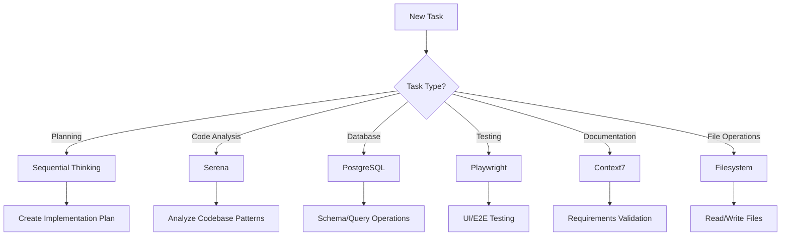

# 🚀 ECOSYSTEM PLATFORM - SERIES A PRODUCTION STANDARDS

## Executive Summary
The Ecosystem Platform is a universal real-world booking and scheduling infrastructure connecting service providers with customers. This document establishes Series A production standards for AI-assisted development, ensuring enterprise-grade quality, scalability, and maintainability.

**Platform Vision**: Build the "Google Calendar meets Shopify meets Uber" for all real-world services, bookings, and transactions.

---

## 🎯 CRITICAL SUCCESS METRICS

### Production Readiness Requirements
- **Performance**: < 100ms API response time (p95), < 3s page load
- **Availability**: 99.9% uptime SLA (< 43min downtime/month)
- **Scale**: Support 100K+ concurrent users, 1M+ daily transactions
- **Security**: SOC 2 Type II compliant, GDPR/CCPA ready
- **Testing**: > 80% code coverage, < 0.1% error rate in production
- **Documentation**: 100% API documentation, comprehensive runbooks

---

## 🤖 AGENT ARCHITECTURE & TASK DELEGATION

### Hierarchical Agent Responsibility Matrix

#### 1. **Primary Analysis Agent** (Sequential Thinking MCP)
**When to Use**: Complex multi-step problems requiring structured reasoning
```
ALWAYS USE FOR:
- Architecture decisions
- Implementation planning
- Complex bug diagnosis
- Performance optimization strategies
- Security threat modeling

EXAMPLE:
"Use sequential thinking to plan the provider onboarding flow implementation"
```

#### 2. **Code Intelligence Agent** (Serena MCP)
**When to Use**: Deep codebase analysis and pattern recognition
```
ALWAYS USE FOR:
- Finding similar code patterns
- Refactoring opportunities
- Dependency analysis
- Symbol search and navigation
- Code quality assessment

EXAMPLE:
"Use Serena to find all components using the booking logic pattern"
```

#### 3. **Documentation Agent** (Context7 MCP)
**When to Use**: Requirements analysis and knowledge retrieval
```
ALWAYS USE FOR:
- PRD interpretation
- Acceptance criteria validation
- API documentation queries
- Compliance requirements
- Best practices lookup

EXAMPLE:
"Use Context7 to verify the booking flow matches acceptance criteria"
```

#### 4. **Database Agent** (PostgreSQL MCP)
**When to Use**: Schema analysis and data validation
```
ALWAYS USE FOR:
- Schema design validation
- Query optimization
- Data migration planning
- Index analysis
- Constraint verification

EXAMPLE:
"Use PostgreSQL MCP to analyze the providers table relationships"
```

#### 5. **Testing Agent** (Playwright MCP)
**When to Use**: UI/UX validation and end-to-end testing
```
ALWAYS USE FOR:
- User flow verification
- Visual regression testing
- Cross-browser compatibility
- Performance testing
- Accessibility validation

EXAMPLE:
"Use Playwright to test the complete provider booking flow"
```

### Task Delegation Protocol

```typescript
// AGENT COORDINATION PATTERN
type TaskComplexity = 'simple' | 'moderate' | 'complex' | 'critical';

const agentSelectionMatrix = {
  simple: ['filesystem'], // Direct file operations
  moderate: ['serena', 'filesystem'], // Code analysis + implementation
  complex: ['sequential-thinking', 'serena', 'postgres', 'filesystem'], // Full stack
  critical: ['sequential-thinking', 'context7', 'serena', 'postgres', 'playwright', 'filesystem'] // Complete validation
};

// ALWAYS follow this delegation pattern:
1. Assess task complexity
2. Engage appropriate agents in sequence
3. Validate results with testing agent
4. Document changes with memory agent
```

---

## 🏗️ INDUSTRY BEST PRACTICES FRAMEWORK

### Code Quality Standards

#### TypeScript Requirements
```typescript
// ✅ ALWAYS use strict typing
interface ProviderProfile {
  id: string;
  userId: string;
  services: Service[];
  availability: AvailabilityWindow[];
  ratings: Rating[];
  stripeAccountId?: string; // Optional but explicit
}

// ❌ NEVER use 'any' type
const processBooking = (data: any) => {}; // FORBIDDEN

// ✅ Use discriminated unions for state management
type BookingState = 
  | { status: 'pending'; requestId: string }
  | { status: 'confirmed'; bookingId: string; confirmationCode: string }
  | { status: 'cancelled'; reason: string; refundAmount?: number }
  | { status: 'completed'; rating?: number; review?: string };
```

#### React/Next.js Standards
```typescript
// ✅ ALWAYS use React Server Components where possible
// app/providers/[id]/page.tsx
export default async function ProviderPage({ params }: { params: { id: string } }) {
  const provider = await getProvider(params.id); // Server-side data fetching
  return <ProviderProfile provider={provider} />;
}

// ✅ Implement proper error boundaries
export function ProviderErrorBoundary({ error, reset }: { error: Error; reset: () => void }) {
  return <ErrorFallback error={error} retry={reset} />;
}

// ✅ Use Suspense for loading states
<Suspense fallback={<ProviderSkeleton />}>
  <ProviderDetails providerId={id} />
</Suspense>
```

#### Database Patterns (Drizzle ORM)
```typescript
// ✅ ALWAYS use transactions for multi-table operations
export async function createBookingWithPayment(bookingData: BookingInput) {
  return await db.transaction(async (tx) => {
    const booking = await tx.insert(bookings).values(bookingData).returning();
    const payment = await tx.insert(payments).values({
      bookingId: booking[0].id,
      amount: bookingData.amount,
    }).returning();
    
    // Rollback automatically on error
    if (!payment[0].id) throw new Error('Payment failed');
    
    return { booking: booking[0], payment: payment[0] };
  });
}

// ✅ Use prepared statements for repeated queries
const getProviderByIdStmt = db
  .select()
  .from(providers)
  .where(eq(providers.id, sql.placeholder('id')))
  .prepare();

// ✅ Implement proper indexing
CREATE INDEX idx_bookings_provider_date ON bookings(provider_id, booking_date);
CREATE INDEX idx_providers_location ON providers USING GIST(location);
```

### Security Protocols

#### Authentication & Authorization
```typescript
// ✅ ALWAYS validate permissions at the API level
export async function updateProvider(
  providerId: string,
  updates: ProviderUpdate,
  userId: string
) {
  // Verify ownership
  const provider = await getProvider(providerId);
  if (provider.userId !== userId) {
    throw new UnauthorizedError('Not authorized to update this provider');
  }
  
  // Validate input
  const validated = providerUpdateSchema.parse(updates);
  
  // Apply rate limiting
  await rateLimit.check(userId, 'provider-update');
  
  return await db.update(providers)
    .set(validated)
    .where(eq(providers.id, providerId));
}
```

#### Data Protection
```typescript
// ✅ ALWAYS sanitize user input
import { z } from 'zod';

const bookingSchema = z.object({
  providerId: z.string().uuid(),
  serviceId: z.string().uuid(),
  date: z.string().datetime(),
  duration: z.number().min(15).max(480), // 15min - 8 hours
  notes: z.string().max(500).optional(),
});

// ✅ Implement proper encryption for sensitive data
import { encrypt, decrypt } from '@/lib/crypto';

export async function storePaymentMethod(userId: string, paymentData: PaymentMethod) {
  const encrypted = await encrypt(paymentData.cardNumber);
  return await db.insert(paymentMethods).values({
    userId,
    last4: paymentData.cardNumber.slice(-4),
    encryptedData: encrypted,
  });
}
```

### Performance Optimization

#### Frontend Optimization
```typescript
// ✅ Implement proper caching strategies
import { unstable_cache } from 'next/cache';

export const getCachedProvider = unstable_cache(
  async (providerId: string) => getProvider(providerId),
  ['provider'],
  {
    revalidate: 60, // Cache for 60 seconds
    tags: [`provider-${providerId}`],
  }
);

// ✅ Use dynamic imports for heavy components
const BookingCalendar = dynamic(() => import('@/components/BookingCalendar'), {
  loading: () => <CalendarSkeleton />,
  ssr: false, // Client-only component
});

// ✅ Implement image optimization
import Image from 'next/image';

<Image
  src={provider.profileImage}
  alt={provider.name}
  width={200}
  height={200}
  placeholder="blur"
  blurDataURL={provider.profileImageBlur}
  priority={isAboveTheFold}
/>
```

#### Database Optimization
```sql
-- ✅ Use materialized views for complex aggregations
CREATE MATERIALIZED VIEW provider_stats AS
SELECT 
  provider_id,
  COUNT(DISTINCT booking_id) as total_bookings,
  AVG(rating) as avg_rating,
  SUM(amount) as total_revenue
FROM bookings
LEFT JOIN reviews ON bookings.id = reviews.booking_id
GROUP BY provider_id;

-- Refresh periodically
CREATE INDEX idx_provider_stats_rating ON provider_stats(avg_rating DESC);
REFRESH MATERIALIZED VIEW CONCURRENTLY provider_stats;
```

---

## 🛠️ MCP SERVER USAGE GUIDELINES

### Decision Tree for Tool Selection



### MCP Server Best Practices

#### 1. **Sequential Thinking** - Structured Problem Solving
```bash
# Use for complex, multi-step problems
"Using sequential thinking, design the provider availability system considering:
1. Recurring schedules
2. Exception handling (holidays, sick days)
3. Timezone management
4. Conflict resolution
5. Real-time updates"
```

#### 2. **Serena** - Code Intelligence
```bash
# Use for pattern recognition and refactoring
"Using Serena, find all instances of direct database access that should use the repository pattern"
```

#### 3. **PostgreSQL** - Database Operations
```bash
# Use for schema analysis and optimization
"Using PostgreSQL MCP, analyze the query performance for the provider search function and suggest index improvements"
```

#### 4. **Playwright** - Testing & Validation
```bash
# Use for end-to-end testing
"Using Playwright, test the complete booking flow from search to payment confirmation"
```

#### 5. **Context7** - Documentation & Knowledge
```bash
# Use for requirements and standards lookup
"Using Context7, verify our implementation meets the PRD requirements for provider onboarding"
```

#### 6. **GitHub** - Repository Management
```bash
# Use for version control operations
"Using GitHub MCP, create a pull request for the provider availability feature with proper labels"
```

#### 7. **Memory** - Context Retention
```bash
# Use for maintaining project context
"Store in memory: The platform fee is 7%, escrow release happens after service completion"
```

#### 8. **Filesystem** - File Operations
```bash
# Use for direct file manipulation
"Using filesystem, create the new provider components in app/providers/components/"
```

---

## 📊 TECHNICAL ARCHITECTURE STANDARDS

### API Design Patterns

#### RESTful API Standards
```typescript
// ✅ Follow REST conventions
GET    /api/providers           // List providers
GET    /api/providers/:id       // Get specific provider
POST   /api/providers           // Create provider
PUT    /api/providers/:id       // Update provider
DELETE /api/providers/:id       // Delete provider

// ✅ Implement proper pagination
GET /api/providers?page=1&limit=20&sort=rating:desc&filter=category:plumber

// ✅ Use proper HTTP status codes
200 OK              // Successful GET
201 Created         // Successful POST
204 No Content      // Successful DELETE
400 Bad Request     // Invalid input
401 Unauthorized    // Authentication required
403 Forbidden       // Permission denied
404 Not Found       // Resource not found
429 Too Many Requests // Rate limit exceeded
500 Internal Error  // Server error
```

#### GraphQL Alternative (Future)
```graphql
type Provider {
  id: ID!
  profile: Profile!
  services: [Service!]!
  availability: [AvailabilityWindow!]!
  bookings(status: BookingStatus): [Booking!]!
  stats: ProviderStats!
}

type Query {
  provider(id: ID!): Provider
  searchProviders(
    location: LocationInput!
    service: String
    availability: DateTimeRange
    pagination: PaginationInput
  ): ProviderConnection!
}
```

### Database Schema Evolution

#### Migration Standards
```sql
-- ✅ ALWAYS use reversible migrations
-- migrations/001_add_provider_verification.sql

-- Up Migration
ALTER TABLE providers 
ADD COLUMN verified BOOLEAN DEFAULT FALSE,
ADD COLUMN verified_at TIMESTAMP,
ADD COLUMN verification_documents JSONB;

CREATE INDEX idx_providers_verified ON providers(verified) WHERE verified = true;

-- Down Migration
DROP INDEX IF EXISTS idx_providers_verified;
ALTER TABLE providers 
DROP COLUMN verified,
DROP COLUMN verified_at,
DROP COLUMN verification_documents;
```

### State Management Patterns

#### Client State Management
```typescript
// ✅ Use Zustand for global client state
import { create } from 'zustand';
import { devtools, persist } from 'zustand/middleware';

interface BookingStore {
  currentBooking: Booking | null;
  bookingHistory: Booking[];
  setCurrentBooking: (booking: Booking) => void;
  addToHistory: (booking: Booking) => void;
  clearCurrentBooking: () => void;
}

export const useBookingStore = create<BookingStore>()(
  devtools(
    persist(
      (set) => ({
        currentBooking: null,
        bookingHistory: [],
        setCurrentBooking: (booking) => set({ currentBooking: booking }),
        addToHistory: (booking) => 
          set((state) => ({ 
            bookingHistory: [...state.bookingHistory, booking] 
          })),
        clearCurrentBooking: () => set({ currentBooking: null }),
      }),
      {
        name: 'booking-storage',
      }
    )
  )
);
```

---

## 🧪 TESTING & QUALITY ASSURANCE

### Testing Pyramid

```
         /\
        /E2E\      (5%) - Critical user flows
       /------\
      /Integration\ (25%) - API & service tests  
     /------------\
    /   Unit Tests  \ (70%) - Component & function tests
   /----------------\
```

### Testing Standards

#### Unit Testing
```typescript
// ✅ Test business logic thoroughly
describe('BookingService', () => {
  describe('calculatePlatformFee', () => {
    it('should calculate 7% platform fee correctly', () => {
      const amount = 100;
      const fee = calculatePlatformFee(amount);
      expect(fee).toBe(7);
    });

    it('should round fee to 2 decimal places', () => {
      const amount = 99.99;
      const fee = calculatePlatformFee(amount);
      expect(fee).toBe(7.00);
    });

    it('should handle zero amount', () => {
      const fee = calculatePlatformFee(0);
      expect(fee).toBe(0);
    });
  });
});
```

#### Integration Testing
```typescript
// ✅ Test API endpoints
describe('POST /api/bookings', () => {
  it('should create booking with valid data', async () => {
    const bookingData = {
      providerId: 'provider-123',
      serviceId: 'service-456',
      date: '2024-01-15T10:00:00Z',
      duration: 60,
    };

    const response = await request(app)
      .post('/api/bookings')
      .set('Authorization', `Bearer ${validToken}`)
      .send(bookingData);

    expect(response.status).toBe(201);
    expect(response.body).toMatchObject({
      id: expect.any(String),
      status: 'pending',
      ...bookingData,
    });
  });
});
```

#### E2E Testing with Playwright
```typescript
// ✅ Test critical user flows
test('Complete booking flow', async ({ page }) => {
  // Search for provider
  await page.goto('/marketplace');
  await page.fill('[data-testid="search-input"]', 'plumber');
  await page.click('[data-testid="search-button"]');
  
  // Select provider
  await page.click('[data-testid="provider-card"]:first-child');
  
  // Choose service and time
  await page.click('[data-testid="service-option"]:first-child');
  await page.click('[data-testid="time-slot"]:first-child');
  
  // Complete booking
  await page.click('[data-testid="book-now-button"]');
  
  // Verify confirmation
  await expect(page.locator('[data-testid="booking-confirmation"]')).toBeVisible();
  await expect(page.locator('[data-testid="confirmation-code"]')).toHaveText(/^[A-Z0-9]{6}$/);
});
```

---

## 🚀 DEPLOYMENT & OPERATIONS

### CI/CD Pipeline Requirements

```yaml
# .github/workflows/production.yml
name: Production Deployment

on:
  push:
    branches: [main]

jobs:
  quality-gates:
    runs-on: ubuntu-latest
    steps:
      - name: Code Coverage Check
        run: |
          coverage=$(npm run test:coverage --silent | grep "All files" | awk '{print $10}' | sed 's/%//')
          if [ $coverage -lt 80 ]; then
            echo "Coverage $coverage% is below 80% threshold"
            exit 1
          fi
      
      - name: Lighthouse Performance Check
        run: |
          score=$(npx lighthouse --output=json --quiet | jq '.categories.performance.score')
          if [ $score -lt 0.9 ]; then
            echo "Performance score $score is below 0.9 threshold"
            exit 1
          fi
      
      - name: Security Audit
        run: npm audit --audit-level=high
      
      - name: Type Check
        run: npm run type-check
```

### Monitoring & Observability

#### Essential Metrics
```typescript
// ✅ Track business metrics
export const metrics = {
  booking: {
    created: new Counter('bookings_created_total'),
    completed: new Counter('bookings_completed_total'),
    cancelled: new Counter('bookings_cancelled_total'),
    revenue: new Histogram('booking_revenue_usd'),
  },
  provider: {
    signups: new Counter('provider_signups_total'),
    verifications: new Counter('provider_verifications_total'),
    activeCount: new Gauge('providers_active_count'),
  },
  platform: {
    apiLatency: new Histogram('api_latency_seconds'),
    errorRate: new Counter('api_errors_total'),
    databaseConnections: new Gauge('database_connections_active'),
  },
};
```

#### Error Tracking with Sentry
```typescript
// ✅ Comprehensive error tracking
Sentry.init({
  dsn: process.env.NEXT_PUBLIC_SENTRY_DSN,
  environment: process.env.NODE_ENV,
  tracesSampleRate: process.env.NODE_ENV === 'production' ? 0.1 : 1.0,
  beforeSend(event, hint) {
    // Sanitize sensitive data
    if (event.request?.cookies) {
      delete event.request.cookies;
    }
    if (event.user?.email) {
      event.user.email = hash(event.user.email);
    }
    return event;
  },
  integrations: [
    new Sentry.BrowserTracing(),
    new Sentry.Replay({
      maskAllText: true,
      blockAllMedia: true,
    }),
  ],
});
```

---

## 📋 DEVELOPMENT WORKFLOW

### Git Workflow Standards

```bash
# Branch naming conventions
feature/provider-availability    # New features
fix/booking-calculation-error    # Bug fixes
refactor/payment-service         # Code refactoring
perf/database-query-optimization # Performance improvements
docs/api-documentation           # Documentation

# Commit message format
feat: add provider availability management
fix: correct platform fee calculation
refactor: extract booking logic to service
perf: optimize provider search query
docs: update API documentation
test: add booking service unit tests
```

### Code Review Checklist

- [ ] **Functionality**: Does the code work as intended?
- [ ] **Tests**: Are there adequate tests? Do they pass?
- [ ] **Security**: No sensitive data exposed? Input validated?
- [ ] **Performance**: No N+1 queries? Proper caching?
- [ ] **Code Quality**: Follows TypeScript/React best practices?
- [ ] **Documentation**: API changes documented? Comments clear?
- [ ] **Accessibility**: WCAG 2.1 AA compliant?
- [ ] **Error Handling**: Graceful error handling and recovery?

---

## 🎓 TEAM COLLABORATION

### Onboarding Protocol

#### Week 1: Foundation
- [ ] Environment setup (all MCP servers configured)
- [ ] Access to all required services (GitHub, Vercel, Supabase, Stripe)
- [ ] Read this CLAUDE.md document completely
- [ ] Complete the onboarding booking flow

#### Week 2: Contribution
- [ ] First PR with mentor review
- [ ] Understand the provider-customer flow
- [ ] Review existing codebase with Serena MCP
- [ ] Shadow a production deployment

#### Week 3: Ownership
- [ ] Own a small feature implementation
- [ ] Participate in architecture discussions
- [ ] Contribute to documentation
- [ ] Present learnings to team

### Communication Protocols

```typescript
// ✅ Document decisions in code
/**
 * Provider Availability Service
 * 
 * Business Context:
 * - Providers set weekly recurring availability
 * - Can override specific dates (holidays, vacation)
 * - Timezone-aware (stored in UTC, displayed in local)
 * 
 * Technical Decisions:
 * - Using RRULE for recurring patterns (RFC 5545)
 * - Caching availability for 5 minutes
 * - Conflict detection happens at booking time
 * 
 * @see https://notion.so/provider-availability-spec
 */
export class ProviderAvailabilityService {
  // Implementation
}
```

---

## 🔐 SECURITY & COMPLIANCE

### Security Checklist

#### Application Security
- [ ] All user input validated with Zod schemas
- [ ] SQL injection prevention via parameterized queries
- [ ] XSS protection with proper React escaping
- [ ] CSRF tokens for state-changing operations
- [ ] Rate limiting on all API endpoints
- [ ] Proper authentication & authorization checks
- [ ] Secrets stored in environment variables
- [ ] HTTPS enforced in production

#### Data Protection
- [ ] PII encrypted at rest
- [ ] PII masked in logs
- [ ] GDPR compliance (right to deletion)
- [ ] CCPA compliance (data portability)
- [ ] Regular security audits
- [ ] Penetration testing quarterly
- [ ] Incident response plan documented

#### Payment Security (PCI Compliance)
- [ ] Never store raw card numbers
- [ ] Use Stripe for all payment processing
- [ ] Audit logs for all financial transactions
- [ ] Webhook signature verification
- [ ] Idempotency keys for payment operations

---

## 📈 SCALING CONSIDERATIONS

### Performance Targets
- **API Response Time**: p50 < 50ms, p95 < 100ms, p99 < 200ms
- **Database Queries**: No query > 100ms
- **Page Load Time**: FCP < 1.5s, TTI < 3.5s
- **Error Rate**: < 0.1% of requests
- **Availability**: 99.9% uptime

### Scaling Strategies

```typescript
// ✅ Implement connection pooling
import { Pool } from 'pg';

const pool = new Pool({
  connectionString: process.env.DATABASE_URL,
  max: 20, // Maximum connections
  idleTimeoutMillis: 30000,
  connectionTimeoutMillis: 2000,
});

// ✅ Use Redis for caching and rate limiting
import Redis from 'ioredis';

const redis = new Redis({
  host: process.env.REDIS_HOST,
  port: process.env.REDIS_PORT,
  maxRetriesPerRequest: 3,
  enableReadyCheck: true,
  lazyConnect: true,
});

// ✅ Implement database read replicas
const readPool = new Pool({
  connectionString: process.env.DATABASE_READ_REPLICA_URL,
  max: 30,
});

// Use read replica for queries
export async function getProvider(id: string) {
  return readPool.query('SELECT * FROM providers WHERE id = $1', [id]);
}
```

---

## 🆘 TROUBLESHOOTING GUIDE

### Common Issues & Solutions

| Issue | Solution |
|-------|----------|
| MCP server not responding | Check environment variables, restart Claude |
| Database connection timeout | Verify DATABASE_URL, check connection limits |
| Stripe webhook failures | Verify webhook secret, check ngrok tunnel |
| Build failures | Clear cache: `rm -rf .next node_modules` |
| Type errors | Run `npm run type-check` to identify issues |
| Test failures | Check for timezone issues, mock external services |

### Debug Commands

```bash
# Check MCP server status
claude mcp list

# Verify environment variables
env | grep -E "DATABASE|STRIPE|CLERK|SUPABASE"

# Test database connection
npx tsx -e "import { db } from './db/db'; db.select().from('providers').limit(1).then(console.log)"

# Check for security vulnerabilities
npm audit

# Analyze bundle size
npx next-bundle-analyzer
```

---

## 📚 QUICK REFERENCE

### Essential Commands
```bash
# Development
npm run dev                     # Start development server
npm run build                   # Build for production
npm run test                    # Run tests
npm run type-check              # TypeScript validation

# Database
npm run db:generate            # Generate migrations
npm run db:migrate             # Apply migrations
npm run supabase:types         # Generate TypeScript types

# Monitoring
npm run benchmark              # Performance benchmarks
npm run test:e2e               # E2E tests with Playwright

# Deployment
npm run pre-deploy-check       # Pre-deployment validation
```

### Environment Variables Reference
```env
# Core Database
DATABASE_URL=                  # PostgreSQL connection string
PG_READONLY_URL=              # Read-only connection

# Authentication (Clerk)
NEXT_PUBLIC_CLERK_PUBLISHABLE_KEY=
CLERK_SECRET_KEY=

# Payments (Stripe)
STRIPE_SECRET_KEY=
STRIPE_WEBHOOK_SECRET=
NEXT_PUBLIC_STRIPE_PUBLISHABLE_KEY=

# Platform Configuration
NEXT_PUBLIC_PLATFORM_FEE_PERCENT=7
NEXT_PUBLIC_APP_URL=

# MCP Servers
GITHUB_TOKEN=                 # For GitHub MCP
NOTION_API_KEY=              # For Notion integration
```

---

## 🎯 SERIES A READINESS CHECKLIST

### Technical Excellence
- [ ] 80%+ test coverage across codebase
- [ ] < 0.1% production error rate
- [ ] All critical paths have E2E tests
- [ ] Performance budgets enforced in CI/CD
- [ ] Security audit passed (OWASP Top 10)
- [ ] API fully documented with OpenAPI spec
- [ ] Disaster recovery plan tested quarterly

### Operational Maturity
- [ ] 99.9% uptime achieved for 3 months
- [ ] Incident response time < 15 minutes
- [ ] Rollback capability < 5 minutes
- [ ] Database backups tested monthly
- [ ] Monitoring covers all critical paths
- [ ] Runbooks for all common issues

### Team Scalability
- [ ] Onboarding time < 1 week for new developers
- [ ] Code review turnaround < 4 hours
- [ ] Documentation coverage > 90%
- [ ] Architecture decision records maintained
- [ ] Knowledge sharing sessions weekly
- [ ] Tech debt tracked and prioritized

### Business Metrics
- [ ] Platform processes 100K+ monthly transactions
- [ ] Provider retention > 85%
- [ ] Customer satisfaction (NPS) > 50
- [ ] Payment success rate > 98%
- [ ] Platform fee collection > 95%

---

## 🚦 CONTINUOUS IMPROVEMENT

This document is a living standard. Update it when:
- New patterns or best practices are established
- Security requirements change
- Performance targets are revised
- New tools or services are integrated
- Lessons learned from incidents

**Last Updated**: January 2025
**Version**: 2.0.0
**Maintainer**: Engineering Team

---

## 💡 REMEMBER

**You are building critical infrastructure for the real-world economy.** Every decision should prioritize:

1. **Reliability** - People depend on this for their livelihood
2. **Security** - Financial and personal data must be protected
3. **Performance** - Every millisecond impacts user experience
4. **Scalability** - Design for 100x growth from day one
5. **Maintainability** - Code should be self-documenting

**"Build it like Google would, ship it like a startup would."**
