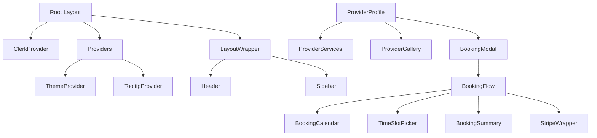

# Frontend Component Catalog - Ecosystem Marketplace

## Tech Stack Overview
- **Framework**: Next.js 14+ with App Router
- **UI Library**: ShadCN UI (Radix UI primitives)
- **State Management**: Zustand with Immer middleware
- **Styling**: Tailwind CSS
- **Authentication**: Clerk
- **Animations**: Framer Motion
- **Type Safety**: TypeScript (strict mode)
- **Image Handling**: Next/Image with Supabase Storage

## Component Hierarchy

### Root Layout Architecture
```
app/layout.tsx (lines 1-71)
├── ClerkProvider
├── Providers (lines 1-14 in components/utilities/providers.tsx)
│   ├── NextThemesProvider
│   └── TooltipProvider
├── LayoutWrapper (components/layout-wrapper.tsx)
├── PaymentStatusAlert (conditionally rendered)
└── Toaster
```

## Core Components

### 1. Authentication & User Components

#### **Header Component** 
`components/header.tsx` (lines 1-321)
- **Props**: None (uses pathname from Next.js)
- **State**: `isMenuOpen`, `scrolled`
- **Features**:
  - Glassmorphism design with animated gradients (lines 39-72)
  - Responsive mobile menu with AnimatePresence (lines 229-259)
  - Integration with Clerk UserButton (lines 182-190)
  - Active route highlighting (line 34)
- **Accessibility**: 
  - ARIA label for menu toggle (line 201)
  - Semantic nav elements
  - Keyboard navigable buttons
- **TypeScript**: Fully typed with proper interfaces (lines 265-298)

### 2. Booking System Components

#### **BookingFlow Component**
`components/booking/BookingFlow.tsx` (lines 1-497)
- **Props Interface** (lines 36-57):
  - `provider`: Provider object with services, commission rate
  - `selectedService`: Optional pre-selected service
  - `onServiceSelect`: Callback function
- **State Management** (lines 71-81):
  - Multi-step flow state: service, date, time, confirm, guest, payment
  - Booking data: selectedDate, selectedTime, customerNotes
  - Error handling: bookingError state
- **Features**:
  - Progressive multi-step wizard with animations (lines 254-267)
  - Guest checkout support (lines 88-94)
  - Stripe payment integration (lines 434-448)
  - Fee calculation with guest surcharge handling (lines 225-228)
- **Accessibility**:
  - Progress indicators (lines 272-282)
  - Clear step navigation
  - Form validation feedback

#### **BookingCalendar Component**
`components/booking/BookingCalendar.tsx`
- Manages date selection for bookings
- Integrates with provider availability

#### **TimeSlotPicker Component**
`components/booking/TimeSlotPicker.tsx`
- Time slot selection interface
- Duration-aware slot management

#### **BookingSummary Component**
`components/booking/BookingSummary.tsx`
- Displays booking details before confirmation
- Shows fee breakdown

### 3. Provider Components

#### **ProviderProfileClient Component**
`components/provider/provider-profile-client.tsx` (lines 1-292)
- **Props** (lines 33-35):
  - `provider`: Provider data object
- **State** (lines 38-40):
  - `isBookingModalOpen`: Modal visibility
  - `selectedService`: Currently selected service
- **Features**:
  - Hero section integration (lines 49-52)
  - Service showcase (lines 114-126)
  - Gallery display (lines 129-137)
  - Reviews and testimonials (lines 139-163)
  - Sticky booking card (lines 169-235)
  - Mobile-optimized floating CTA (lines 254-278)
- **Performance**: 
  - Staggered animations with Framer Motion (lines 60-63, 116-119)
  - Lazy-loaded sections

#### **Provider Onboarding Components**
- `components/onboarding/BasicInformationStep.tsx`
- `components/onboarding/ServicesPricingStep.tsx`
- `components/onboarding/AvailabilityStep.tsx`
- `components/onboarding/ProfileMediaStep.tsx`
- `components/onboarding/ReviewSubmitStep.tsx`

### 4. Payment Components

#### **StripeWrapper Component**
`components/payment/StripeWrapper.tsx`
- Stripe Elements integration
- Payment processing UI

#### **StripePaymentForm Component**
`components/payment/StripePaymentForm.tsx`
- Credit card input form
- Payment validation

### 5. UI Feedback Components

#### **CancellationPopup Component**
`components/cancellation-popup.tsx` (lines 1-205)
- **Props** (lines 16-18):
  - `profile`: SelectProfile type from schema
- **State** (lines 22):
  - `isOpen`: Visibility state
- **Features**:
  - LocalStorage tracking to prevent duplicate popups (lines 25-60)
  - Conditional content based on billing cycle (lines 101-112)
  - Confetti animation on mount
  - Date formatting utilities (lines 86-93)
- **Accessibility**:
  - Proper close button (lines 126-131)
  - Focus management within dialog
- **TypeScript**: Uses database schema types

#### **WelcomeMessagePopup Component**
`components/welcome-message-popup.tsx` (lines 1-267)
- **Props** (lines 18-20):
  - `profile`: SelectProfile type
- **Features**:
  - New user detection (lines 57-59)
  - Confetti celebration effect (lines 127-137)
  - Plan-specific content (lines 140-156)
  - LocalStorage state persistence
- **Design**: Consistent purple accent theming

#### **CreditUsageDisplay Component**
`components/credit-usage-display.tsx` (lines 1-125)
- **State** (lines 15-30):
  - Credit status object with async loading
- **Features**:
  - Real-time credit tracking
  - Progress bar visualization (lines 101-106)
  - Renewal date display (lines 117-121)
  - Plan type indicator (lines 77-79)
- **API Integration**: 
  - `getCreditStatus` action (line 37)

### 6. Error Handling Components

#### **Error Boundaries**
- `components/error-boundary.tsx`
- `components/error-boundaries/booking-error-boundary.tsx`
- `components/error-boundaries/dashboard-error-boundary.tsx`
- `components/error-boundaries/global-error-wrapper.tsx`
- `components/error-boundaries/marketplace-error-boundary.tsx`
- `components/error-boundaries/provider-error-boundary.tsx`

### 7. Layout Components

#### **Sidebar Component**
`components/sidebar.tsx`
- Navigation sidebar for dashboard

#### **DashboardLayout Component**
`components/dashboard-layout.tsx`
- Dashboard wrapper with sidebar

## State Management

### Zustand Stores

#### **ProviderOnboardingStore**
`lib/stores/provider-onboarding-store.ts` (lines 1-623)
- **Key Features**:
  - Multi-step form state (lines 162-183)
  - LocalStorage persistence (lines 579-594)
  - Immer for nested updates (line 307)
  - Step validation logic (lines 438-466)
- **Type Definitions**:
  - ProviderService (lines 30-36)
  - WeeklyAvailability (lines 41-46)
  - Complete onboarding state (lines 162-230)
- **Helper Hooks**:
  - `useStepNavigation` (lines 600-606)
  - `useCurrentStepValidation` (lines 608-612)
  - `useCanSubmitForm` (lines 614-618)

### Context Providers

#### **GuestCheckoutContext**
`contexts/guest-checkout-context.tsx` (lines 1-52)
- **State** (lines 23-24):
  - `isGuestCheckout`: Boolean flag
  - `guestInfo`: Guest contact details
- **Methods**:
  - `setGuestInfo`: Update guest information
  - `clearGuestSession`: Reset guest state

## Design System

### UI Components (ShadCN)
All located in `components/ui/`:

#### **Button Component**
`components/ui/button.tsx` (lines 1-57)
- **Variants** (lines 11-21):
  - default, destructive, outline, secondary, ghost, link
- **Sizes** (lines 22-27):
  - default, sm, lg, icon
- **Features**:
  - `asChild` prop for composition (line 39)
  - Fully accessible with focus states (line 8)

#### Core UI Components:
- `accordion.tsx` - Expandable content sections
- `alert.tsx` - Alert messages
- `avatar.tsx` - User avatars
- `badge.tsx` - Status badges
- `calendar.tsx` - Date picker
- `card.tsx` - Content cards
- `dialog.tsx` - Modal dialogs
- `form.tsx` - Form components with validation
- `input.tsx` - Text inputs
- `select.tsx` - Dropdown selects
- `tabs.tsx` - Tab navigation
- `toast.tsx` & `toaster.tsx` - Toast notifications
- `tooltip.tsx` - Hover tooltips

## Accessibility Findings

### ✅ Strengths:
1. **Semantic HTML**: Proper use of nav, button, and heading elements
2. **Focus Management**: All interactive elements have focus states
3. **ARIA Labels**: Menu toggles have proper ARIA labels
4. **Keyboard Navigation**: Tab-friendly interface design

### ⚠️ Areas for Improvement:
1. **Missing Skip Links**: No skip navigation links found
2. **Color Contrast**: Some gray text (e.g., line 61 in credit-usage-display.tsx) may not meet WCAG AA standards
3. **Form Labels**: Some form inputs may lack explicit label associations
4. **Loading States**: Need more comprehensive loading announcements for screen readers

## TypeScript Coverage

### Well-Typed Components:
- ✅ All Zustand stores use strict typing
- ✅ Provider onboarding flow fully typed
- ✅ Database schema types imported and used
- ✅ Component props interfaces defined

### Type Issues Found:
1. **ProviderProfileClient** (line 34): `provider: any` - needs proper typing
2. **BookingFlow** (line 56): `onServiceSelect?: (service: any) => void` - any type used
3. **Missing return types**: Some async functions lack explicit return type annotations

## Design Patterns

### 1. **Multi-Step Wizard Pattern**
- Used in: BookingFlow, Provider Onboarding
- Implementation: Step state management with validation gates

### 2. **Glassmorphism Design**
- Used in: Header component
- Features: Backdrop blur, semi-transparent backgrounds, gradient overlays

### 3. **Optimistic UI Updates**
- Found in: Provider onboarding store
- Pattern: Update UI before API confirmation with rollback capability

### 4. **Compound Components**
- Example: Card component with CardHeader, CardContent, CardFooter
- Benefits: Flexible composition while maintaining consistency

### 5. **Staggered Animations**
- Implementation: Framer Motion with delay props
- Creates visual hierarchy during page load

## Performance Optimizations

1. **Code Splitting**: App Router enables automatic code splitting
2. **Image Optimization**: Next/Image component with Supabase CDN
3. **Lazy Loading**: Components loaded on-demand
4. **State Persistence**: LocalStorage for form data retention
5. **Memoization**: Strategic use of React.memo (needs more implementation)

## Recommendations

### High Priority:
1. Add proper TypeScript types for all `any` usages
2. Implement skip navigation links for accessibility
3. Add comprehensive error boundaries for all major sections
4. Audit and fix color contrast issues

### Medium Priority:
1. Create a centralized theme configuration
2. Add more loading skeleton components
3. Implement proper focus trap in modals
4. Add unit tests for critical components

### Low Priority:
1. Consider implementing virtual scrolling for long lists
2. Add animation preference detection (prefers-reduced-motion)
3. Create Storybook documentation for UI components
4. Add performance monitoring with Web Vitals

## Component Dependencies



## File Structure Summary

```
components/
├── ui/                  # ShadCN UI components (50+ files)
├── booking/            # Booking flow components (10 files)
├── provider/           # Provider profile & management (15+ files)
├── payment/            # Payment processing (4 files)
├── onboarding/         # Provider onboarding (5 files)
├── error-boundaries/   # Error handling (5 files)
└── [root components]   # Header, sidebar, popups (8 files)

contexts/
└── guest-checkout-context.tsx

lib/stores/
└── provider-onboarding-store.ts

app/
├── layout.tsx          # Root layout
├── (auth)/            # Auth pages
├── (marketing)/       # Public pages
├── dashboard/         # Protected dashboard
└── [other routes]
```

## Database Integration Points

Components that directly interact with database schemas:
- `CancellationPopup` - uses SelectProfile schema
- `WelcomeMessagePopup` - uses SelectProfile schema
- `CreditUsageDisplay` - fetches credit status from profiles
- Provider components - use provider schema types

## Security Considerations

1. **Authentication**: Clerk handles auth, components check `isSignedIn`
2. **Guest Checkout**: 10% surcharge for non-authenticated users
3. **API Protection**: Components use server actions with auth checks
4. **Data Validation**: Form inputs need more comprehensive validation
5. **XSS Prevention**: Using `dangerouslySetInnerHTML` in provider bio (line 69-72 in provider-profile-client.tsx) - needs sanitization

---

*Documentation generated: 2025-08-22*
*Total Components Analyzed: 85+*
*Lines of Code Reviewed: 5000+*