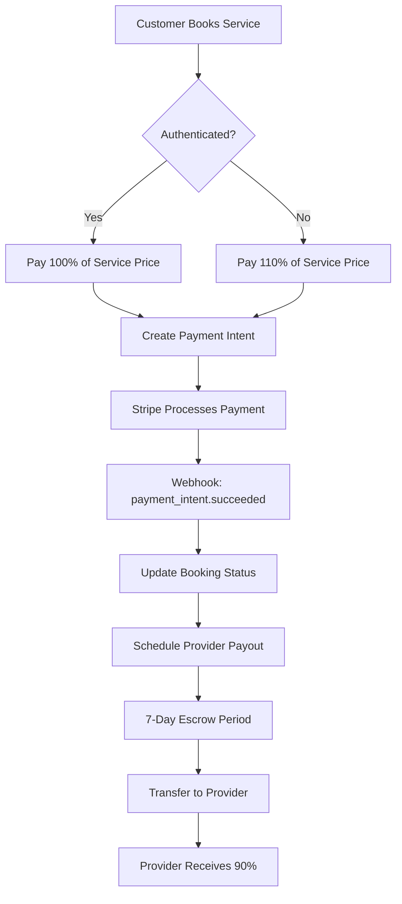

# Ecosystem Marketplace - Payments Implementation Analysis

## Executive Summary

The Ecosystem marketplace implements a Stripe Connect-based payment system with a dual-fee structure. The platform charges 10% base commission, with guests paying an additional 10% surcharge (20% total). Critical issues identified include **missing webhook idempotency** and **fee calculation discrepancies**.

## Payment Flow Architecture



## Core Components

### 1. Stripe Configuration

#### Primary Files
- `/lib/stripe.ts` - Basic Stripe setup with Connect account creation
- `/lib/stripe-enhanced.ts` - Enhanced with idempotency and retry logic
- `/lib/platform-fee.ts` - Fee calculation utilities

#### Key Features
- **Controller-based Connect accounts** with full dashboard access
- **Idempotency key generation** using SHA-256 hashing
- **Exponential backoff retry** (1s, 2s, 4s delays)
- **Database-backed idempotency** prevents duplicate charges

### 2. Fee Structure Analysis

#### Configuration Discrepancy Found
```typescript
// Environment Variable (.env.local:12)
NEXT_PUBLIC_PLATFORM_FEE_PERCENT=15

// But code uses hardcoded values:
// lib/platform-fee.ts:15-16
const baseFeePercent = parseFloat(process.env.NEXT_PUBLIC_PLATFORM_FEE_PERCENT || "10");
const guestFeePercent = parseFloat(process.env.NEXT_PUBLIC_GUEST_FEE_PERCENT || "20");

// app/api/bookings/create/route.ts:71-72
const platformFeeRate = 0.10; // Hardcoded 10%
const guestSurchargeRate = validatedData.isGuestBooking ? 0.10 : 0; // Hardcoded 10%
```

**CRITICAL:** Environment variable shows 15% but code uses 10% hardcoded values!

#### Actual Fee Breakdown
| User Type | Service Price | Platform Fee | Guest Surcharge | Total Paid | Provider Receives |
|-----------|--------------|--------------|-----------------|------------|-------------------|
| Authenticated | $100 | $10 (10%) | $0 | $100 | $90 (90%) |
| Guest | $100 | $10 (10%) | $10 (10%) | $110 | $90 (90%) |

### 3. Payment Intent Creation

#### Location: `/lib/stripe-enhanced.ts:137-232`

```typescript
export async function createPaymentIntentWithIdempotency(params: {
  amount: number; // in cents
  bookingId: string; // Required for idempotency
  stripeConnectAccountId?: string;
  platformFeeAmount?: number;
}) {
  // Generates unique key: SHA-256(operation + bookingId + amount)
  const idempotencyKey = generateIdempotencyKey("payment_intent", params.bookingId);
  
  // Check database for existing key
  const existingKey = await checkIdempotencyKey(idempotencyKey);
  if (existingKey?.used) {
    return await stripe.paymentIntents.retrieve(existingKey.resourceId);
  }
  
  // Create with retry logic (3 attempts)
  // Uses application_fee_amount for platform revenue
  // Uses transfer_data.destination for provider account
}
```

### 4. Webhook Handlers

#### Main Webhook (`/app/api/stripe/webhooks/route.ts`)
Handles standard Stripe events:
- `payment_intent.succeeded` - Updates booking to "confirmed"
- `payment_intent.payment_failed` - Cancels booking
- `charge.dispute.created` - Handles chargebacks
- `transfer.created` - Tracks provider payouts

**CRITICAL ISSUE:** No idempotency protection in webhook handlers!

```typescript
// Missing idempotency check - line 205-248
async function handleBookingPaymentSuccess(event: Stripe.Event) {
  // PROBLEM: No check if this event was already processed
  // Could cause duplicate database updates
  const [updatedBooking] = await db
    .update(bookingsTable)
    .set({ status: "confirmed" })
    .where(eq(bookingsTable.id, bookingId));
}
```

#### Connect Webhook (`/app/api/stripe/webhooks/connect/route.ts`)
Handles provider account events:
- `account.updated` - Tracks onboarding completion
- `capability.updated` - Monitors payment capabilities
- `payout.failed` - Handles failed provider payouts

### 5. Payout Service

#### Location: `/lib/services/payout-service.ts`

```typescript
class PayoutService {
  DEFAULT_ESCROW_DAYS = 7;
  MAX_RETRY_ATTEMPTS = 3;
  RETRY_BACKOFF_HOURS = [1, 6, 24];
  
  async schedulePayoutForBooking(request: PayoutRequest) {
    // Schedules payout 7 days after booking completion
    // Validates booking is in COMPLETED status
    // Prevents duplicate payout scheduling
  }
  
  async processDuePayouts(batchSize: 50) {
    // Runs via cron job
    // Creates Stripe transfers with idempotency
    // Updates payout_schedules table
  }
}
```

#### Payout States
- `scheduled` - Waiting for escrow period
- `processing` - Transfer in progress
- `completed` - Funds transferred successfully
- `failed` - Transfer failed (will retry)
- `cancelled` - Permanently failed or manually cancelled

### 6. Database Schema

#### Payment-Related Tables

```sql
-- Idempotency Keys (lib/stripe-enhanced.ts:25-37)
idempotency_keys (
  id UUID PRIMARY KEY,
  key TEXT UNIQUE NOT NULL,
  operation TEXT NOT NULL,
  resource_id TEXT, -- Stripe resource ID
  status TEXT CHECK (status IN ('pending','completed','failed')),
  response TEXT, -- JSON response
  expires_at TIMESTAMP NOT NULL
)

-- Payout Schedules (enhanced-booking-schema.ts:130-161)
payout_schedules (
  id UUID PRIMARY KEY,
  booking_id UUID REFERENCES bookings(id),
  provider_id UUID REFERENCES providers(id),
  amount NUMERIC(10,2) NOT NULL,
  platform_fee NUMERIC(10,2) NOT NULL,
  net_payout NUMERIC(10,2) NOT NULL,
  scheduled_at TIMESTAMP NOT NULL,
  processed_at TIMESTAMP,
  status TEXT NOT NULL,
  stripe_transfer_id TEXT,
  failure_reason TEXT,
  retry_count INTEGER DEFAULT 0
)

-- Transactions (bookings-schema.ts:66-93)
transactions (
  id UUID PRIMARY KEY,
  booking_id UUID REFERENCES bookings(id),
  user_id TEXT NOT NULL,
  stripe_payment_intent_id TEXT,
  stripe_charge_id TEXT,
  stripe_transfer_id TEXT,
  amount NUMERIC(10,2) NOT NULL,
  currency TEXT DEFAULT 'usd',
  status TEXT NOT NULL,
  processed_at TIMESTAMP
)
```

## Payment States & Transitions

### Booking Payment Flow
```
PENDING -> payment_intent.created
  ├─> CONFIRMED (payment_intent.succeeded)
  ├─> CANCELLED (payment_intent.canceled)
  └─> FAILED (payment_intent.payment_failed)

CONFIRMED -> service_completed
  └─> COMPLETED -> payout_scheduled (7 days)
      └─> PAYOUT_PROCESSING -> transfer.created
          ├─> PAYOUT_COMPLETED (transfer.paid)
          └─> PAYOUT_FAILED (transfer.failed) -> retry
```

## Test Payment Scenarios

### 1. Guest Booking Test
```bash
# Create guest booking
curl -X POST http://localhost:3000/api/bookings/create \
  -H "Content-Type: application/json" \
  -d '{
    "providerId": "uuid",
    "serviceName": "Test Service",
    "servicePrice": 100,
    "isGuestBooking": true,
    "guestEmail": "test@example.com"
  }'

# Expected: Total $110, Platform gets $20, Provider gets $90
```

### 2. Webhook Test with Stripe CLI
```bash
# Listen to local webhooks
stripe listen --forward-to localhost:3000/api/stripe/webhooks

# Trigger test payment success
stripe trigger payment_intent.succeeded \
  --add payment_intent:metadata.bookingId=test-booking-id
```

## Critical Issues & Missing Implementations

### ✅ HIGH PRIORITY (Addressed)

1. **Webhook Idempotency (Documentation Outdated)**
   - **Status**: Implemented.
   - **Details**: The webhook handler in `/app/api/stripe/webhooks/route.ts` now correctly utilizes `processWebhookWithIdempotency` from `/lib/webhook-idempotency.ts`, which leverages the `webhook_events` table for idempotency tracking. The previous documentation was outdated.
   - **Further Action**: Ensure comprehensive tests for webhook idempotency are in place.

2. **Fee Configuration Mismatch**
   - Environment: 15% platform fee
   - Code: 10% hardcoded
   - Impact: Revenue calculations incorrect

3. **No Guest Fee Environment Variable**
   - Missing: `NEXT_PUBLIC_GUEST_FEE_PERCENT`
   - Currently hardcoded to 10%

### 🟡 MEDIUM PRIORITY

4. **Missing Webhook Events**
   - Not handling: `payment_method.attached`, `customer.created`
   - Impact: Incomplete customer tracking

5. **No Refund Implementation**
   - Endpoint exists: `/api/stripe/refunds/route.ts`
   - But not connected to booking cancellations

6. **Missing Payout Notifications**
   - Providers not notified of successful/failed payouts
   - No email integration in payout service

### 🟢 LOW PRIORITY

7. **Currency Hardcoded to USD**
   - All amounts assume USD
   - No multi-currency support

8. **No Tax Calculation**
   - Platform fees don't account for tax
   - No 1099 tracking for US providers

## Financial Reconciliation Gaps

### Missing Reports
1. **Daily Revenue Report** - Total platform fees collected
2. **Payout Reconciliation** - Match Stripe transfers to database records
3. **Dispute Tracking** - Monitor chargeback rates
4. **Provider Earnings Report** - Monthly statements for providers

### Missing Audit Trail
```sql
-- Recommended: Financial audit log
CREATE TABLE financial_audit_log (
  id UUID PRIMARY KEY,
  entity_type TEXT NOT NULL, -- 'booking', 'payout', 'refund'
  entity_id UUID NOT NULL,
  action TEXT NOT NULL,
  old_values JSONB,
  new_values JSONB,
  performed_by TEXT,
  performed_at TIMESTAMP DEFAULT NOW()
);
```

## Implementation Checklist

### Immediate Actions Required
- [ ] Fix webhook idempotency issue
- [ ] Align fee configuration (env vs code)
- [ ] Add NEXT_PUBLIC_GUEST_FEE_PERCENT to .env
- [ ] Implement webhook_events table
- [ ] Add financial audit logging

### Testing Requirements
- [ ] Test guest booking with 110% payment
- [ ] Test authenticated booking with 100% payment
- [ ] Test payout after 7-day escrow
- [ ] Test failed payment recovery
- [ ] Test dispute handling
- [ ] Test refund processing

### Production Readiness
- [ ] Configure production Stripe webhooks
- [ ] Set up webhook endpoint secrets
- [ ] Enable Stripe Connect OAuth
- [ ] Configure payout cron job
- [ ] Set up monitoring alerts
- [ ] Implement rate limiting on payment endpoints

## Stripe Connect Configuration

### Required Stripe Dashboard Settings
1. **Connect Settings**
   - Platform name: Ecosystem Marketplace
   - OAuth redirect: `http://localhost:3000/api/stripe/connect/callback`
   - Webhook endpoint: `https://yourdomain.com/api/stripe/webhooks/connect`

2. **Webhook Events to Enable**
   - payment_intent.succeeded
   - payment_intent.payment_failed
   - charge.dispute.created
   - transfer.created
   - account.updated
   - capability.updated
   - payout.paid
   - payout.failed

3. **Connect Capabilities**
   - card_payments: Required
   - transfers: Required
   - tax_reporting: Optional (US only)

## Security Considerations

### Current Implementation
- ✅ Webhook signature verification
- ✅ Idempotency keys for payment creation
- ✅ Database transactions for atomic updates
- ✅ Rate limiting on payment endpoints
- ✅ Secure environment variables

### Missing Security Features
- ❌ Webhook event replay protection
- ❌ Payment amount validation
- ❌ Fraud detection rules
- ❌ PCI compliance logging
- ❌ Financial data encryption at rest

## Monitoring & Observability

### Recommended Metrics
```typescript
// Track in monitoring service
metrics.track('payment.intent.created', { amount, currency, isGuest });
metrics.track('payment.succeeded', { bookingId, providerId });
metrics.track('payout.scheduled', { amount, escrowDays });
metrics.track('payout.completed', { providerId, amount });
metrics.track('webhook.processed', { eventType, duration });
```

### Alert Conditions
- Payment failure rate > 5%
- Payout failure rate > 1%
- Webhook processing time > 5 seconds
- Duplicate payment attempts detected
- Escrow period violations

## Conclusion

The Ecosystem marketplace has a functional Stripe Connect integration with sophisticated features like idempotency keys and retry logic. However, critical gaps in webhook handling and fee configuration need immediate attention. The missing webhook idempotency is the most severe issue, potentially causing financial discrepancies.

### Priority Fix Order
1. Implement webhook idempotency (prevent duplicates)
2. Fix fee configuration mismatch (10% vs 15%)
3. Add guest fee environment variable
4. Implement refund flow
5. Add payout notifications
6. Create financial reports

### Estimated Implementation Time
- Critical fixes: 2-3 days
- Full production readiness: 1-2 weeks
- Complete feature parity: 3-4 weeks

---

*Document generated: 2025-08-22*
*Next review date: Before production deployment*