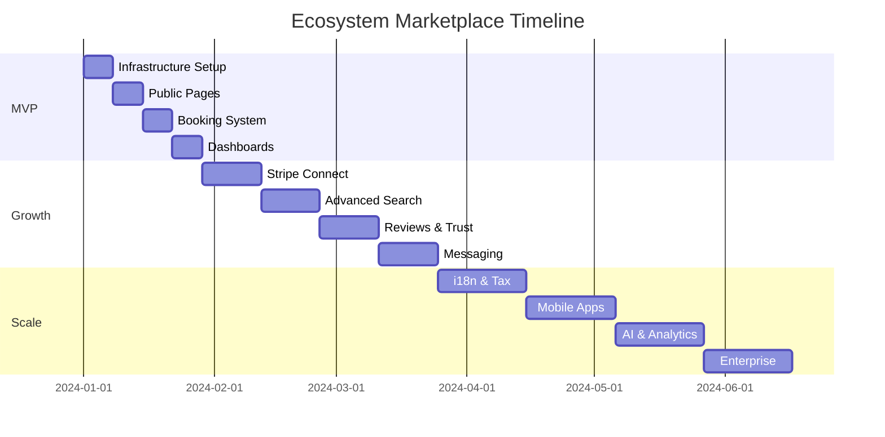

# Ecosystem Marketplace Roadmap

## Executive Summary

Ecosystem is a two-sided marketplace connecting service providers with customers, positioned as the "Airbnb for services." This roadmap defines three distinct phases with explicit scope boundaries and success metrics.

**Current State**: Basic infrastructure with auth (Clerk), database schemas, and provider profile components built but not wired to production-grade frontend.

**Target State**: Production-ready marketplace serving real traffic with provider profiles, booking system, and dashboards.

## Phase 1: MVP (Weeks 1-4) 🎯

### Goal
Launch a functional marketplace where providers can create profiles and customers can browse and book services (with stub payments).

### Core Features

#### Public Experience
- **Landing Page** (`/`)
  - Hero: "Find Trusted Service Providers Near You"
  - Category cards (6 primary categories)
  - Featured providers carousel (8 providers)
  - Trust metrics (X providers, Y bookings, Z reviews)
  - Dual CTAs: "Find Services" / "Become a Provider"

- **Provider Browse** (`/providers`)
  - Server-side rendered grid (12 per page)
  - Filters: Category, Price band ($, $$, $$$), Rating (4+), Location
  - Search: Basic text search across names/services
  - Sort: Relevance, Price, Rating, Newest
  - Provider cards: Image, name, tagline, rating, starting price, "View Profile"

- **Provider Profile** (`/providers/[slug]`)
  - Hero: Cover image, profile photo, name, tagline, location
  - Gallery: Up to 12 portfolio images
  - About: Rich text with markdown support
  - Services: List with descriptions and starting prices
  - Testimonials: Featured reviews carousel
  - Availability: Weekly schedule preview
  - CTAs: "Book Now" (modal), "Contact" (rate-limited form)

#### Booking System
- **Create Booking** (`POST /api/bookings`)
  - Availability check against slots
  - Optimistic hold pattern
  - Idempotency key required
  - Email confirmation (console stub in dev)
  - Status: Draft → Pending → Confirmed

- **Cancel Booking** (`POST /api/bookings/{id}/cancel`)
  - 24-hour cancellation window
  - Status update with reason
  - Email notification (stub)

#### Provider Dashboard (`/dashboard/provider`)
- **Overview**: Stats cards (bookings this week, total earnings placeholder, rating)
- **Bookings**: Table with status, customer, service, date/time
- **Profile Editor**: Update all profile sections
- **Availability**: CRUD weekly recurring slots
- **Settings**: Notification preferences, payout info (placeholder)

#### Customer Dashboard (`/dashboard/customer`)
- **Upcoming**: Bookings cards with provider info, service, time
- **History**: Past bookings with rebooking option
- **Saved**: Favorite providers list
- **Reviews**: Write reviews for completed bookings

### Technical Scope
- Next.js app router with TypeScript
- Postgres with Drizzle ORM
- Clerk authentication
- Stripe payment links (stub for MVP)
- Server-side search (no external service)
- Email notifications (console/log in dev)

### Success Metrics
- [ ] 8 complete provider profiles seeded
- [ ] Browse page loads <2s (p95)
- [ ] Booking flow completion >60%
- [ ] Zero critical bugs in production
- [ ] Mobile responsive (375px minimum)

### Out of Scope (MVP)
- Real payment processing
- Stripe Connect onboarding
- Provider payouts
- Advanced profile customization
- Messaging/chat
- Review moderation
- i18n/l10n
- Mobile apps

## Phase 2: Growth (Weeks 5-12) 📈

### Goal
Enable real money flow with Stripe Connect and enhance discovery/trust features.

### Core Features

#### Payment Infrastructure
- **Stripe Connect Express**
  - Onboarding flow in dashboard
  - KYC/KYB verification
  - Bank account linking
  - Payout scheduling (daily/weekly)

- **Booking Payments**
  - Payment intent creation
  - Platform fee calculation (15% default)
  - Hold & capture pattern
  - Refund processing
  - Dispute handling

#### Enhanced Discovery
- **Advanced Search**
  - Elasticsearch/Typesense integration
  - Faceted search
  - Autocomplete
  - Typo tolerance
  - Geo-search ("near me")

- **Recommendation Engine**
  - "Similar providers"
  - "Customers also viewed"
  - Personalized homepage

#### Trust & Safety
- **Review System**
  - Verified booking requirement
  - Photo uploads
  - Response from providers
  - Moderation queue
  - Review insights (sentiment analysis)

- **Provider Verification**
  - Identity verification via Stripe
  - Business verification
  - Insurance documentation
  - Certification uploads
  - Verification badges

#### Communication
- **Messaging System**
  - Thread-based conversations
  - Booking context attachment
  - Read receipts
  - Push notifications
  - Spam detection

### Success Metrics
- [ ] 100+ active providers
- [ ] $10K GMV/month
- [ ] <2% payment failure rate
- [ ] 70% provider response rate
- [ ] 4.0+ average provider rating

## Phase 3: Scale (Weeks 13+) 🚀

### Goal
Build marketplace moat through network effects and platform capabilities.

### Core Features

#### International Expansion
- **Localization**
  - Multi-language support (5 languages)
  - Multi-currency (USD, EUR, GBP, CAD, AUD)
  - Local payment methods
  - Regional compliance (GDPR, CCPA)

- **Tax Compliance**
  - Stripe Tax integration
  - VAT/GST calculation
  - DAC7 reporting (EU)
  - 1099 generation (US)
  - Invoice generation

#### Platform Intelligence
- **Analytics Dashboard**
  - Provider performance metrics
  - Market insights
  - Demand forecasting
  - Pricing recommendations
  - Competition analysis

- **AI Features**
  - Smart matching
  - Dynamic pricing
  - Fraud detection
  - Churn prediction
  - Quality scoring

#### Mobile Experience
- **Native Apps**
  - iOS app (React Native)
  - Android app
  - Push notifications
  - Offline mode
  - Native payments (Apple Pay, Google Pay)

#### Enterprise Features
- **Teams & Organizations**
  - Multi-provider accounts
  - Centralized billing
  - Admin roles
  - Bulk booking
  - API access

- **White Label**
  - Custom domains
  - Brand customization
  - Revenue sharing
  - Dedicated support

### Success Metrics
- [ ] 1000+ active providers
- [ ] $100K+ GMV/month
- [ ] 50% mobile traffic
- [ ] 20% international revenue
- [ ] 30-day retention >40%

## Implementation Timeline

## Key Decisions

### Technical Architecture
- **Frontend**: Next.js 14 App Router for SEO and performance
- **Database**: PostgreSQL with row-level security ready schemas
- **Authentication**: Clerk (no change planned)
- **Payments**: Stripe (Links → Connect → Tax progression)
- **Search**: PostgreSQL FTS → Elasticsearch (Phase 2)
- **Infrastructure**: Vercel + Supabase (current) → consider AWS/GCP at scale

### Business Model
- **Revenue**: 15% platform fee (configurable per provider)
- **Pricing**: Free for providers, commission-based
- **Growth**: SEO-driven acquisition, provider referrals
- **Moat**: Network effects, trust/reviews, payment convenience

### Risk Mitigations
- **Double-booking**: Pessimistic locking with holds
- **Payment failures**: Retry logic with exponential backoff
- **Fraud**: Stripe Radar + custom rules
- **Compliance**: ToS shifts liability to providers initially
- **Scale**: Database sharding plan at 10K providers

## Success Criteria

### MVP Launch Gate
- [ ] All core features implemented
- [ ] Seed data for 8 providers
- [ ] Manual QA completed
- [ ] Documentation complete
- [ ] Monitoring configured

### Growth Launch Gate
- [ ] Stripe Connect approved
- [ ] Payment flow tested with real money
- [ ] Legal review completed
- [ ] Support processes defined
- [ ] 10 beta providers onboarded

### Scale Launch Gate
- [ ] Load testing passed (1000 concurrent users)
- [ ] Disaster recovery tested
- [ ] SOC 2 Type 1 readiness
- [ ] International entity setup
- [ ] $50K MRR achieved

## Next Steps

1. **Immediate** (This Week)
   - Complete spec pack review
   - Start MVP implementation per BACKLOG.md
   - Set up development environment
   - Configure monitoring

2. **Short-term** (Next 2 Weeks)
   - Complete MVP features
   - Seed showcase providers
   - Internal testing
   - Fix critical bugs

3. **Medium-term** (Weeks 3-4)
   - Beta provider recruitment
   - Public soft launch
   - Gather feedback
   - Iterate on UX

## Appendix: Feature Comparison

| Feature | MVP | Growth | Scale |
|---------|-----|--------|-------|
| Provider Profiles | ✅ Basic | ✅ Enhanced | ✅ Customizable |
| Booking System | ✅ Stub | ✅ Real payments | ✅ Bulk/Recurring |
| Search | ✅ Basic | ✅ Advanced | ✅ AI-powered |
| Payments | ⚠️ Links only | ✅ Connect | ✅ Multi-currency |
| Mobile | ✅ Responsive | ✅ PWA | ✅ Native apps |
| i18n | ❌ | ⚠️ 2 languages | ✅ 5+ languages |
| Analytics | ⚠️ Basic | ✅ Dashboard | ✅ Predictive |
| API | ⚠️ Internal | ✅ Partner | ✅ Public |

---

*This roadmap is a living document. Updates require approval from product and engineering leads.*

*Last updated: 2024-01-15*
*Next review: 2024-02-01*