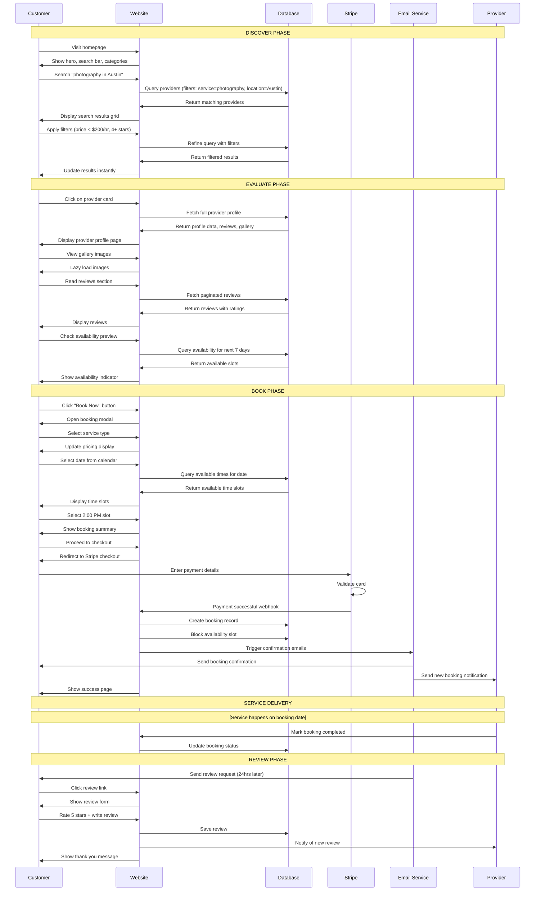
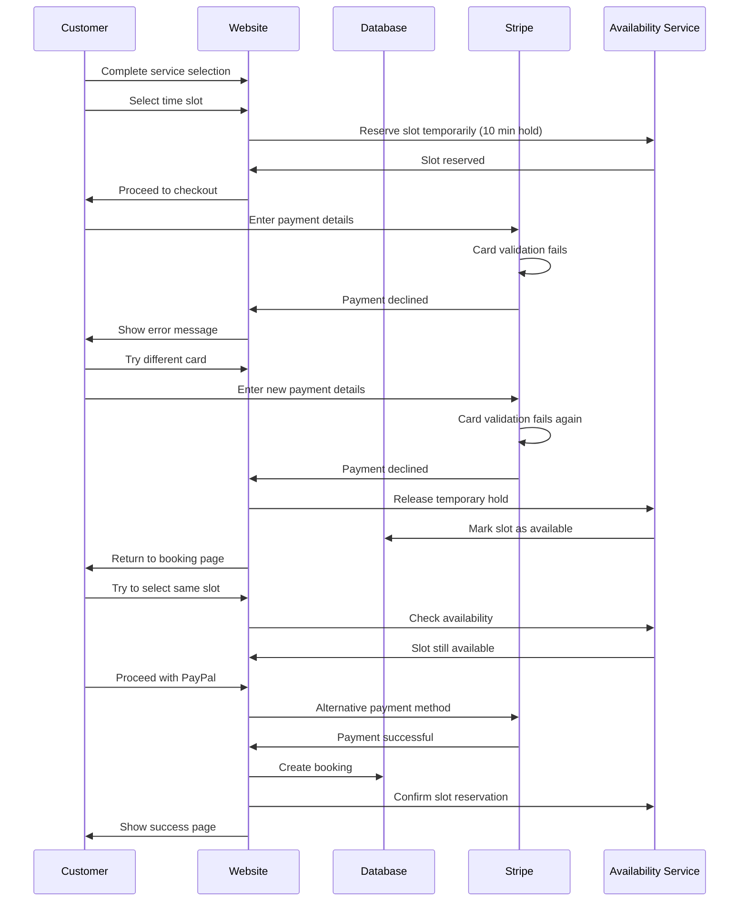
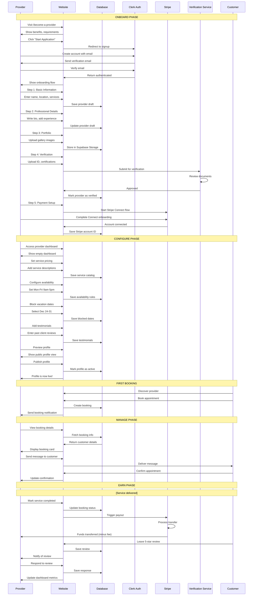
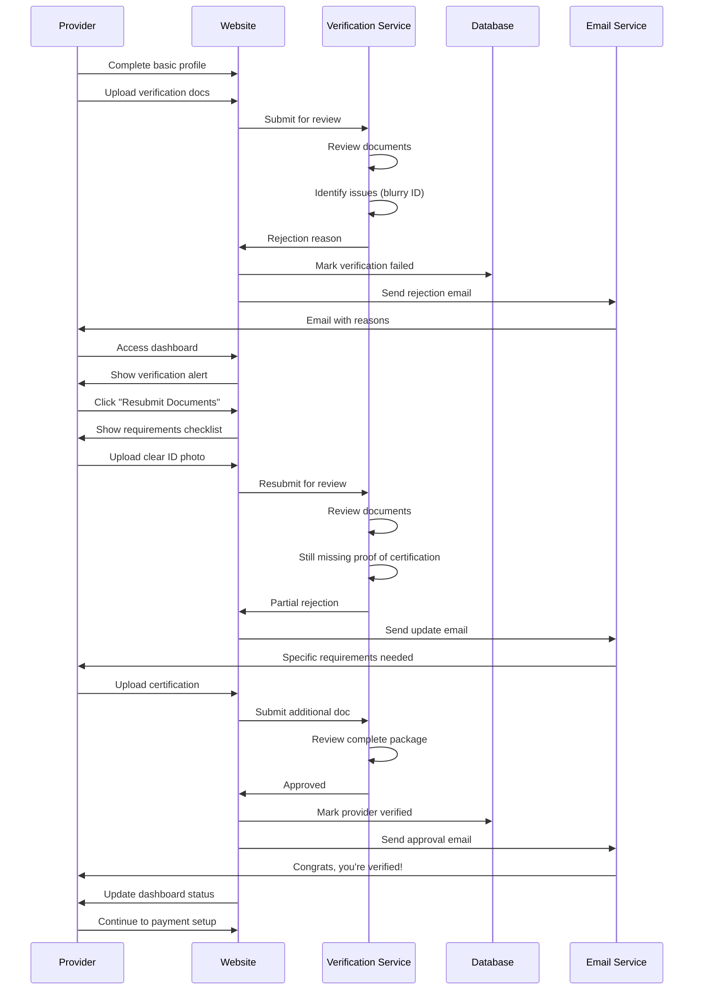
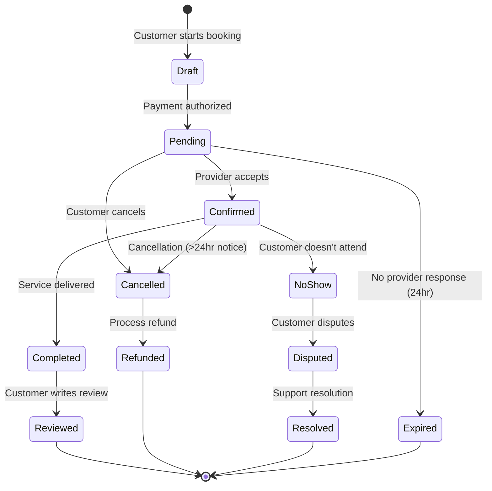
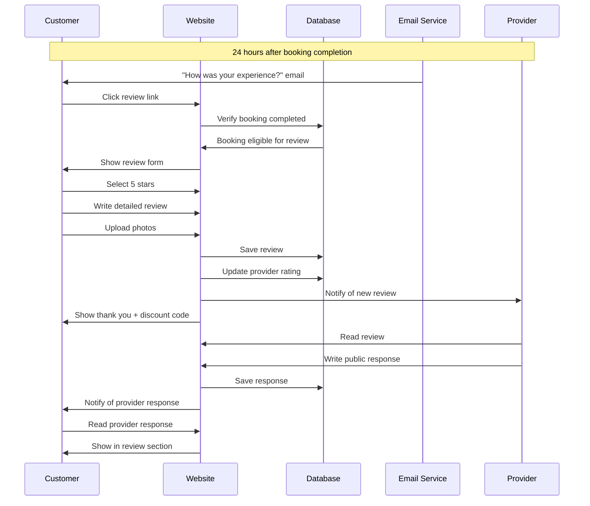
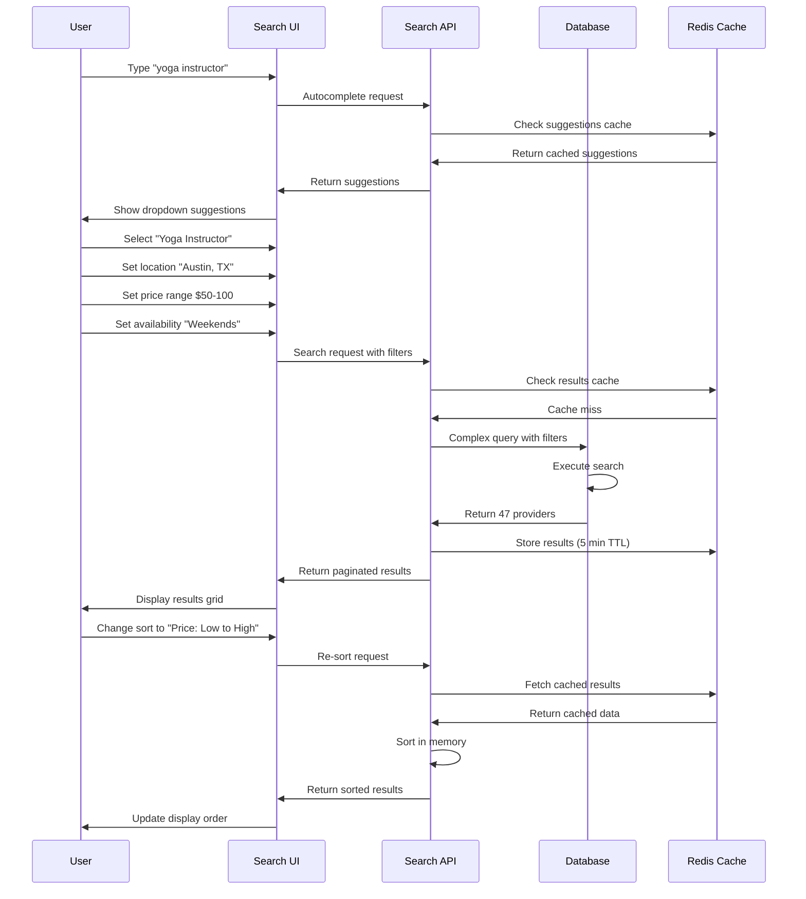
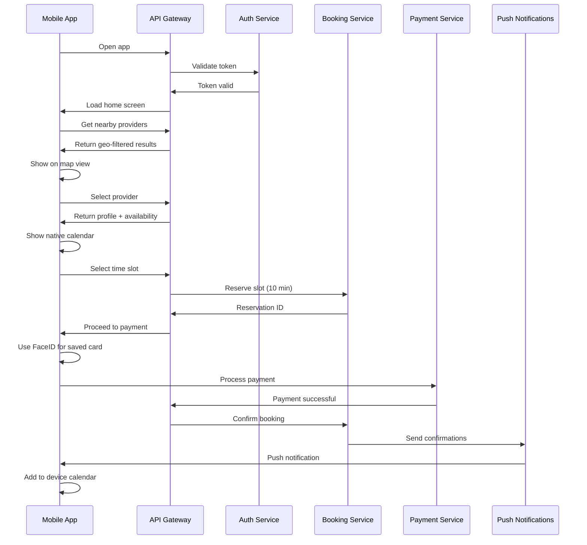

# User Experience Flows

## Customer Journey: Discover → Evaluate → Book → Review

### Happy Path: Successful Booking

### Failure Scenario: Payment Declined

## Provider Journey: Onboard → Configure → Manage → Earn

### Happy Path: Provider Onboarding to First Booking

### Failure Scenario: Verification Rejected

## Booking State Transitions

## Review Flow

## Search & Filter Flow

## Mobile App Booking Flow (Future)

