# Wireframes and Workflow Diagrams
## Visual Design Specifications for Critical Features

**Version**: 1.0  
**Date**: January 2025  
**Status**: Ready for UI Development

---

## 1. Search & Discovery Wireframes

### 1.1 Desktop Search Interface Layout

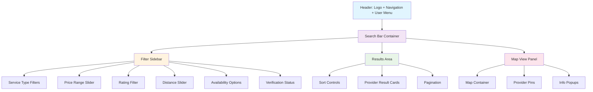

### 1.2 Mobile Search Interface Flow

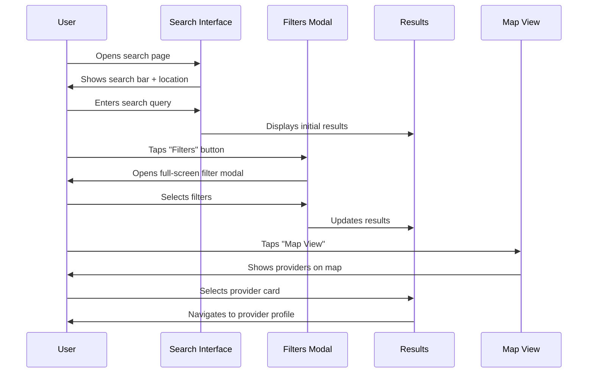

### 1.3 Search Result Card Wireframe

```
┌─────────────────────────────────────────────────────┐
│ ┌─────────┐ Provider Name                    ❤️ 💬   │
│ │ Avatar  │ ⭐⭐⭐⭐⭐ 4.8 (124 reviews)              │
│ │ Image   │ 📍 Distance • Service Category            │
│ │ 80x80   │ 💰 Starting at $XX/hr                    │
│ └─────────┘                                          │
│ 🛡️ Verified ⚡ Instant Booking 📅 Available Today    │
│ ┌─────────────────┐ ┌─────────────────┐             │
│ │   View Profile  │ │   Quick Book    │             │
│ └─────────────────┘ └─────────────────┘             │
└─────────────────────────────────────────────────────┘
```

---

## 2. Homepage Redesign Wireframes

### 2.1 Desktop Homepage Layout

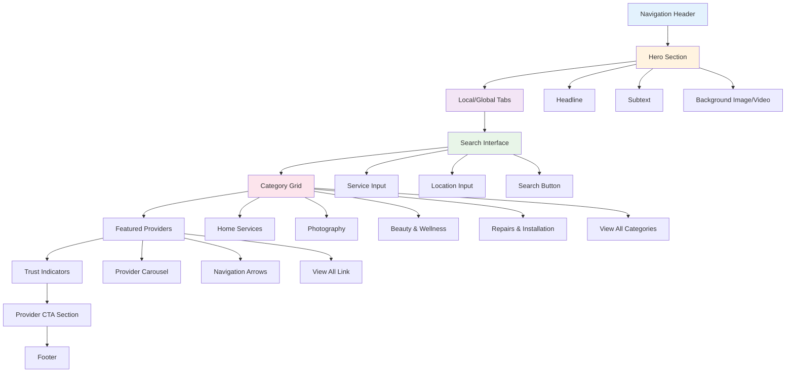

### 2.2 Mobile Homepage Stack

```
┌─────────────────────────────────────┐
│ ☰ ECOSYSTEM           🔔 👤        │ ← Header
├─────────────────────────────────────┤
│          Find Trusted               │
│       Service Providers             │ ← Hero
│         Near You                    │
│                                     │
│ ┌─ LOCAL ─┐ ┌─ GLOBAL ─┐           │ ← Tabs
│ │ Austin  │ │Anywhere │             │
│ └─────────┘ └─────────┘             │
│                                     │
│ [What service do you need?]         │ ← Search
│ [📍 Current Location]               │
│ [🔍 Find Providers]                 │
│                                     │
│ Popular Categories                  │ ← Categories
│ ┌─────────────────────────────────┐ │
│ │ 🏠 Home Services (156)          │ │
│ └─────────────────────────────────┘ │
│ ┌─────────────────────────────────┐ │
│ │ 📸 Photography (89)             │ │
│ └─────────────────────────────────┘ │
│ ┌─────────────────────────────────┐ │
│ │ ✨ Beauty & Wellness (234)      │ │
│ └─────────────────────────────────┘ │
│                                     │
│ Top Providers in Your Area          │ ← Featured
│ ┌─────────────────────────────────┐ │
│ │ 📷 Sarah Johnson               │ │
│ │ ⭐⭐⭐⭐⭐ Photography            │ │
│ │ 📍 2 mi • $150/hr              │ │
│ └─────────────────────────────────┘ │
└─────────────────────────────────────┘
```

### 2.3 Local vs Global Tab Workflow

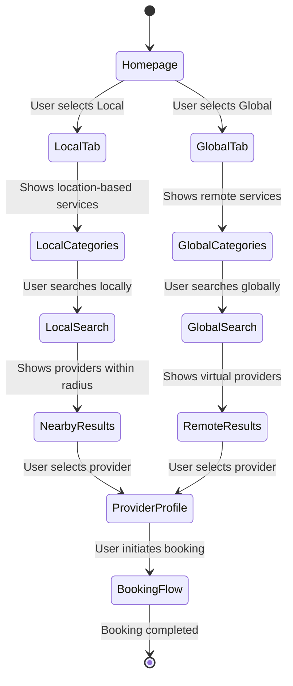

---

## 3. Customer Account Interface Wireframes

### 3.1 Account Dashboard Desktop Layout

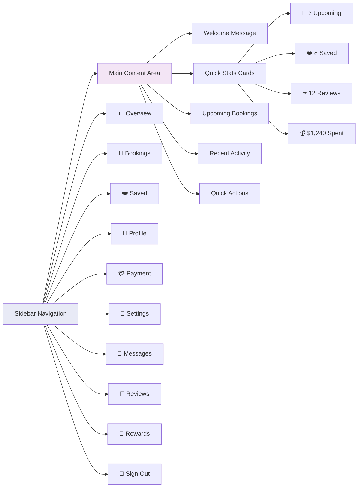

### 3.2 Mobile Account Navigation

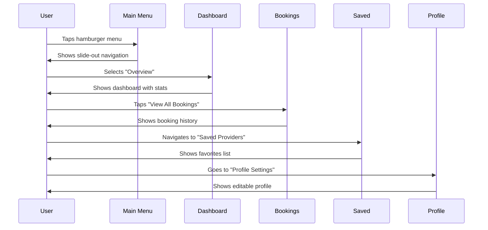

### 3.3 Booking Management Interface

```
┌─────────────────────────────────────────────────────────────┐
│ My Bookings                        [Filter ▼] [Search 🔍]   │
├─────────────────────────────────────────────────────────────┤
│ ┌─ UPCOMING (3) ─┐ ┌─ COMPLETED ─┐ ┌─ CANCELLED ─┐         │
│ │ Active filter  │ │ (12 total)  │ │ (1 total)   │         │
│ └────────────────┘ └─────────────┘ └─────────────┘         │
│                                                             │
│ ┌─────────────────────────────────────────────────────────┐ │
│ │ 📷 Photography Session with Sarah Johnson               │ │
│ │ 📅 Tomorrow, Jan 28 • 2:00 PM - 4:00 PM                │ │
│ │ 📍 Zilker Park, Austin TX                               │ │
│ │ 💰 $300 (paid) • Confirmation #12345                   │ │
│ │                                                         │ │
│ │ [📱 Contact] [📝 Details] [⏰ Reschedule] [❌ Cancel]   │ │
│ └─────────────────────────────────────────────────────────┘ │
│                                                             │
│ ┌─────────────────────────────────────────────────────────┐ │
│ │ 🏠 Home Cleaning with Maria's Service                   │ │
│ │ 📅 Feb 2, 2025 • 9:00 AM - 12:00 PM                    │ │
│ │ 📍 Home Address (saved)                                 │ │
│ │ 💰 $180 (pending payment)                               │ │
│ │                                                         │ │
│ │ [💳 Pay Now] [📝 Details] [⏰ Reschedule] [❌ Cancel]   │ │
│ └─────────────────────────────────────────────────────────┘ │
└─────────────────────────────────────────────────────────────┘
```

---

## 4. Provider Verification Workflows

### 4.1 Verification Progress Flow

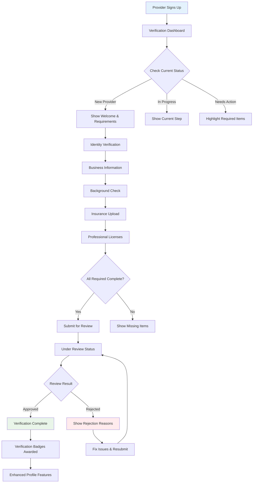

### 4.2 Insurance Upload Workflow

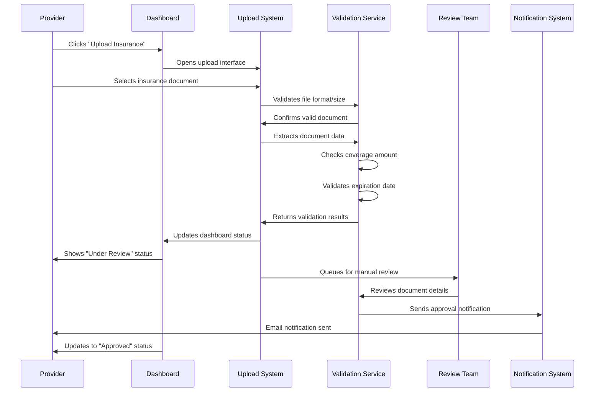

### 4.3 Customer Trust Signal Display

```
┌─────────────────────────────────────────────────────────────┐
│ 📷 Sarah Johnson Photography     🛡️ VERIFIED PROVIDER       │
│ ⭐⭐⭐⭐⭐ 4.9 (127 reviews)                                   │
│ 📍 Austin, TX • Available today                            │
│ 💰 Starting at $150/hr                                     │
│                                                             │
│ ┌─ Trust & Safety ────────────────────────────────────────┐ │
│ │ ✅ Identity Verified    ✅ Background Checked           │ │
│ │ ✅ Insured ($1M)        ✅ 5+ Years Experience          │ │
│ │ ✅ Professional License ✅ 98% Response Rate             │ │
│ │                                                         │ │
│ │ Verified on: Dec 20, 2024                              │ │
│ │ [Learn about verification]                              │ │
│ └─────────────────────────────────────────────────────────┘ │
│                                                             │
│ [📱 Message] [❤️ Save] [📅 Check Availability] [🔥 Book]   │
└─────────────────────────────────────────────────────────────┘
```

---

## 5. Mobile-First Interaction Patterns

### 5.1 Mobile Search Filter Modal

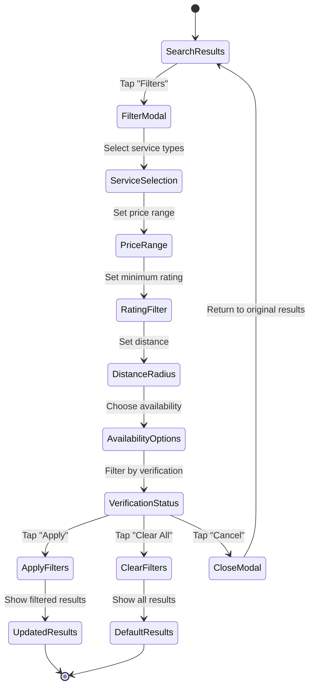

### 5.2 Mobile Provider Card Interactions

```
┌─────────────────────────────────────┐
│ ┌───────┐ Sarah Johnson            │ ← Tap for profile
│ │ Photo │ ⭐⭐⭐⭐⭐ 4.9 (127)         │
│ │ 60x60 │ 📍 2 mi • Photography    │ ← Swipe for more info
│ └───────┘ 💰 $150/hr               │
│ ❤️ 💬 📅 🔥                         │ ← Quick action buttons
│ Save|Msg|Check|Book                 │
└─────────────────────────────────────┘
```

### 5.3 Mobile Booking Flow Simplified

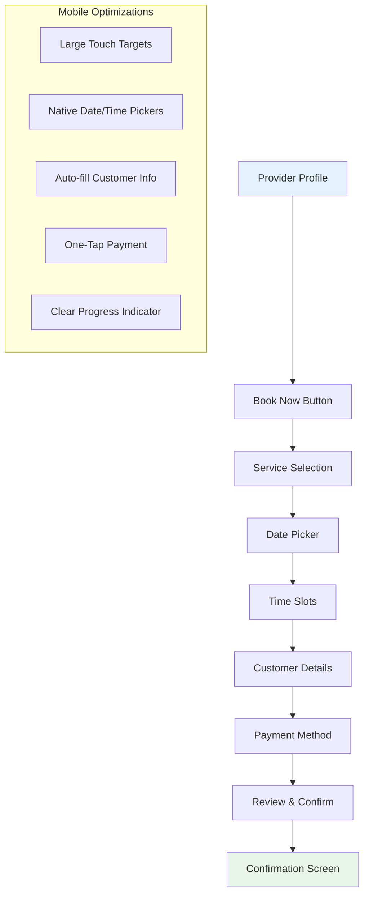

---

## 6. Responsive Design Breakpoints

### 6.1 Layout Adaptation Pattern

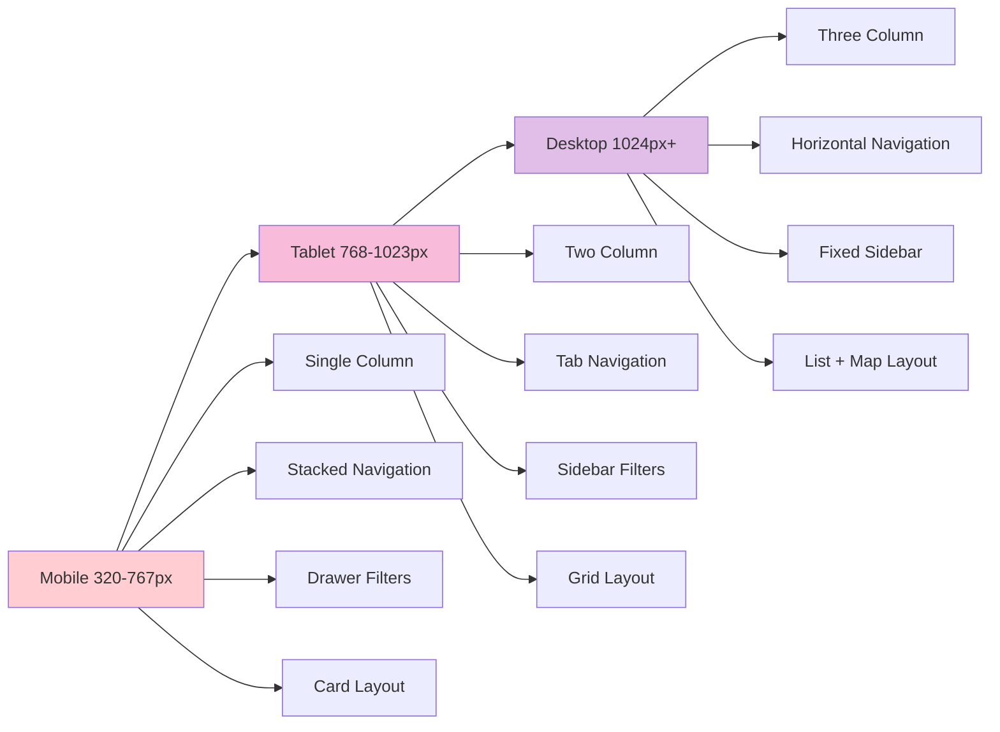

### 6.2 Component Scaling Strategy

```
Mobile (320px)          Tablet (768px)         Desktop (1024px+)
┌─────────────────┐    ┌─────────────────────┐  ┌─────────────────────────┐
│ Full Width      │    │ 2-Column Grid       │  │ 3-Column Layout         │
│ ┌─────────────┐ │    │ ┌────────┬────────┐ │  │ ┌──────┬──────┬──────┐  │
│ │ Search Bar  │ │    │ │Filter  │Results │ │  │ │Filter│Result│ Map  │  │
│ └─────────────┘ │    │ │Sidebar │ Grid   │ │  │ │ 280px│ Grid │ 400px│  │
│ ┌─────────────┐ │    │ │ 200px  │ Rest   │ │  │ │      │ Rest │      │  │
│ │ Filter Btn  │ │    │ └────────┴────────┘ │  │ └──────┴──────┴──────┘  │
│ └─────────────┘ │    └─────────────────────┘  └─────────────────────────┘
│ ┌─────────────┐ │
│ │ Result 1    │ │
│ └─────────────┘ │
│ ┌─────────────┐ │
│ │ Result 2    │ │
│ └─────────────┘ │
└─────────────────┘
```

---

## 7. Accessibility Interaction Patterns

### 7.1 Keyboard Navigation Flow

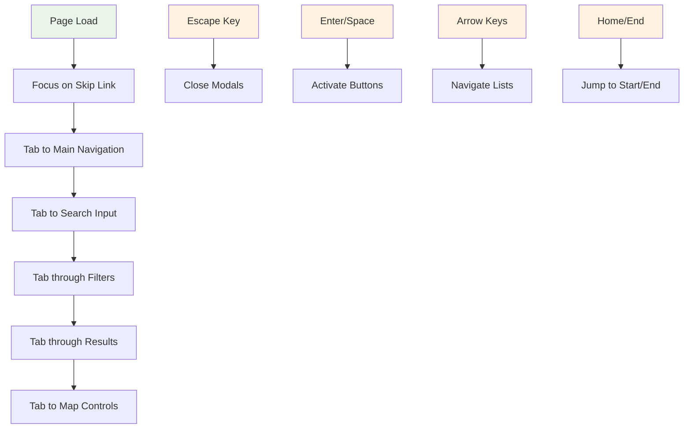

### 7.2 Screen Reader Information Architecture

```
Page Structure for Screen Readers:
├── Skip to main content link
├── Main navigation landmark
├── Search region
│   ├── Search input with label
│   ├── Filter options with descriptions
│   └── Results status announcement
├── Main content area
│   ├── Heading hierarchy (h1 → h2 → h3)
│   ├── Provider cards with ARIA labels
│   └── Pagination with current page info
├── Complementary sidebar
│   └── Additional filters and options
└── Footer information
```

### 7.3 ARIA Implementation Pattern

```html
<!-- Search Interface Example -->
<div role="search" aria-label="Provider search">
  <label for="search-input">Find service providers</label>
  <input 
    id="search-input"
    type="search"
    aria-describedby="search-help"
    aria-expanded="false"
    aria-autocomplete="list"
  />
  <div id="search-help">
    Enter service type like photography or cleaning
  </div>
  
  <div 
    role="region" 
    aria-label="Search results"
    aria-live="polite"
    aria-atomic="false"
  >
    <div aria-label="12 providers found">
      <!-- Provider cards with proper headings and labels -->
    </div>
  </div>
</div>
```

---

## 8. Error States and Edge Cases

### 8.1 Search Error States

```mermaid
flowchart TD
    A[User Searches] --> B{Results Found?}
    B -->|Yes| C[Display Results]
    B -->|No| D[No Results State]
    
    D --> E[Show "No providers found"]
    E --> F[Suggest alternatives]
    F --> G[Expand search radius]
    F --> H[Try different keywords]
    F --> I[Browse categories]
    
    A --> J{Network Error?}
    J -->|Yes| K[Show offline message]
    K --> L[Retry button]
    K --> M[Cached results if available]
    
    A --> N{Invalid Location?}
    N -->|Yes| O[Location error message]
    O --> P[Use current location]
    O --> Q[Manual location entry]
    
    style D fill:#ffebee
    style K fill:#ffebee
    style O fill:#ffebee
```

### 8.2 Loading States Pattern

```
Search Loading States:
┌─────────────────────────────────────┐
│ Searching for providers...          │ ← Initial search
│ ┌─────────┐ ┌─────────┐ ┌─────────┐ │
│ │ ████████│ │ ████████│ │ ████████│ │ ← Skeleton cards
│ │ ████████│ │ ████████│ │ ████████│ │
│ └─────────┘ └─────────┘ └─────────┘ │
│                                     │
│ Loading map...                      │ ← Map loading
│ ┌─────────────────────────────────┐ │
│ │ ▒▒▒▒▒▒▒▒▒▒▒▒▒▒▒▒▒▒▒▒▒▒▒▒▒▒▒▒▒▒▒ │ │
│ └─────────────────────────────────┘ │
└─────────────────────────────────────┘
```

---

## 9. Component State Management

### 9.1 Search Interface State Flow

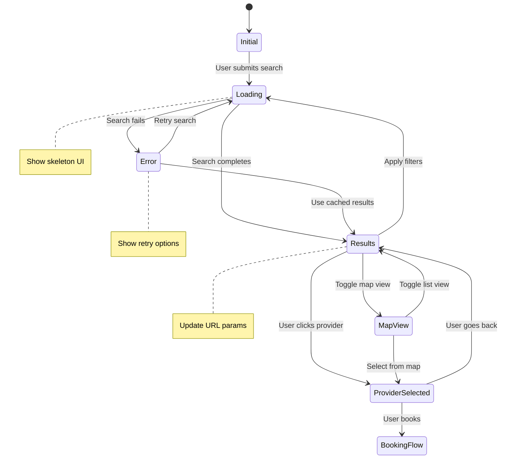

### 9.2 Account Dashboard State Management

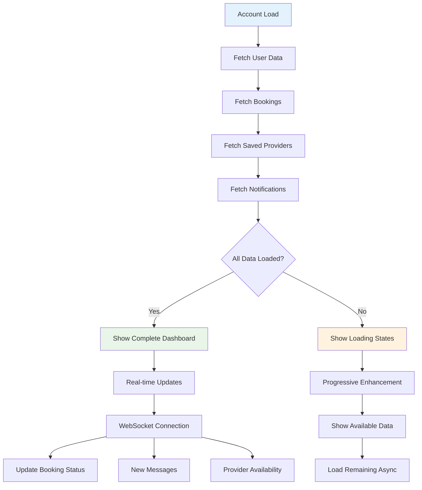

---

## 10. Implementation Priority Matrix

### 10.1 Feature Implementation Order

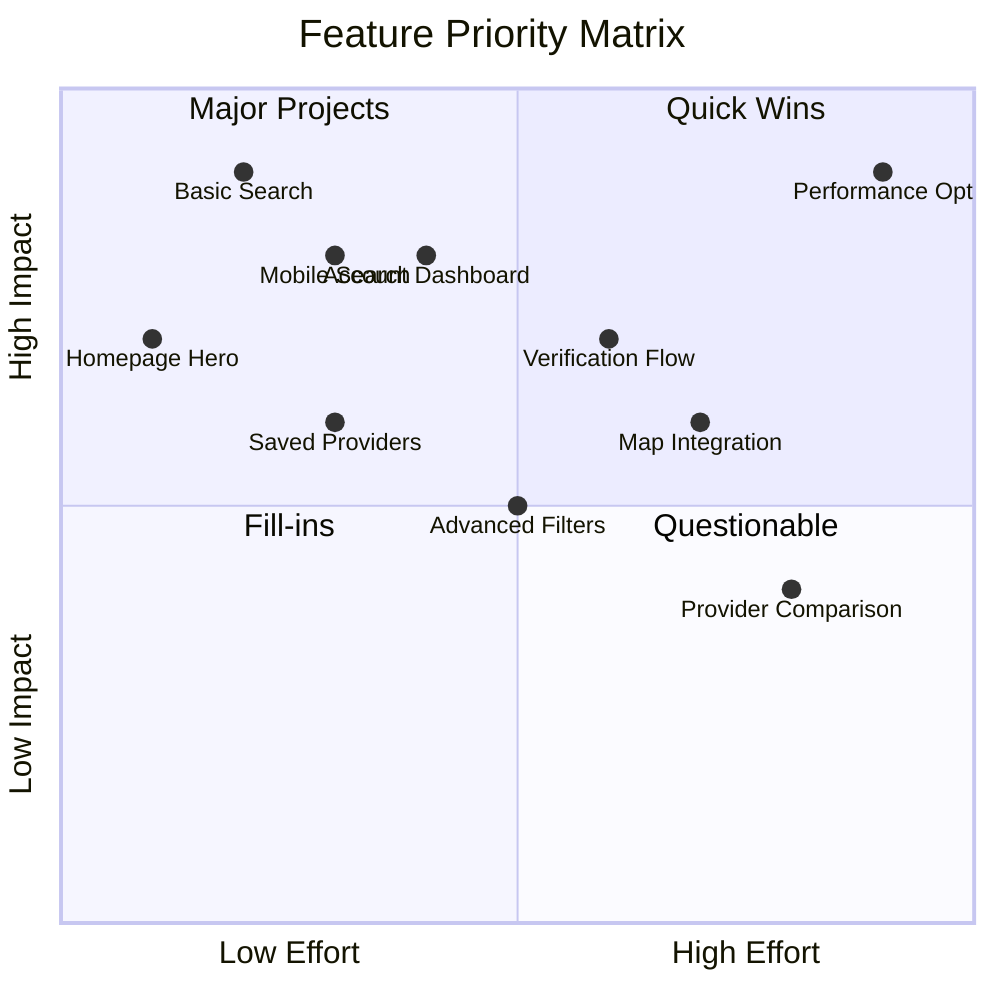

### 10.2 Development Timeline

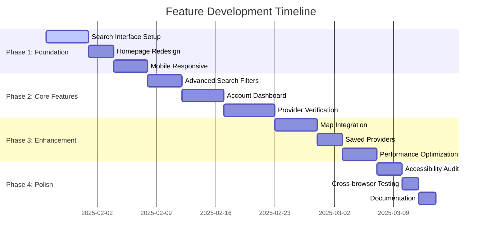

---

*Wireframes and Workflows Document Version 1.0*  
*Visual specifications ready for UI development*  
*All diagrams use standard Mermaid syntax for easy rendering*  
*Next step: Convert wireframes to high-fidelity designs*